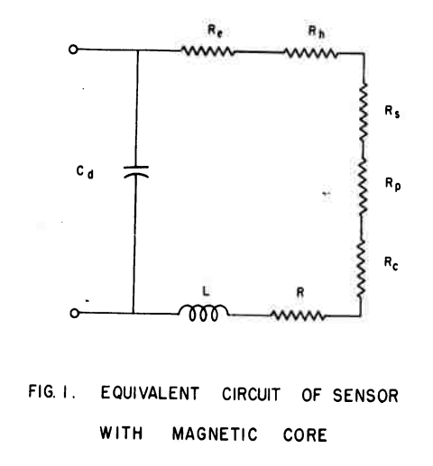

Coil Resistance
===============

The resistances in the antenna are divided into ohmic losses and the radiation resistance. Ohmic losses in the antenna are caused by losses in the wire itself and losses in the ferrite core. Increased losses lead to the antenna being less sensitive at the resonant frequency. The half-power bandwidth also becomes wider [Koskimaa, 2016].

Witzig investigated high-frequency resistance of coils [Witzig, 1947]. 

.. math::
	:label: R_c

	R_c = K_\tau R_0 (0.38 d \sqrt{f} + 0.25)

K_τ is an empirical constant. When a coil is used at a frequency near its resonant frequency, its resistance is modified by its self-capacitance. This self-capacitance increases the circulating current flowing in the coil and hence gives rise to a greater coil loss. Apparent coil resistance can be shown as [Witzig, 1947] 

.. math::
	:label: R_c_res

	\begin{array}{c}
	R_c^{resonance} = \frac{R_c}{(1-\omega^2 L C_0)^2}\\
	C_0 = 4.55 \cdot 10^{-14} \frac{l_r}{\ln{0.72l_r/d_r}}
	\end{array}

.. rubric:: Wire Resistance with Skin and Proximity Effect

The **skin effect** is caused by eddy currents in the conductor. A current flowing in a conductor creates a magnetic field around it. Magnetic field induces circular eddy currents that oppose the change in the magnetic field. This leads to the eddy currents being in the opposite direction of the original current flow in the center of the conductor. Near the surface or skin of the conductor the eddy currents flow in the original current direction. Most of the current now flows near the conductor surface thus the effective conducting area is reduced. 

The surface resistance of a conductor is 

.. math::
	:label: R_surface

	R_s = \sqrt{\frac{\omega\mu}{2\sigma}}

For a wire with length lw and radius rw the wire resistance is 

.. math::
	:label: R_wire

	R_w = \frac{l_w}{2\pi r_w} \sqrt{\frac{\omega\mu}{2\sigma}}

For a coil with radius rc this becomes

.. math::
	:label: R_wire_2

	R_w = N \frac{r_c}{r_w} \sqrt{\frac{\omega\mu}{2\sigma}}

The **proximity effect** loss is similarly to the skin effect caused by eddy currents. The magnetic field created by a conductor induces eddy currents in nearby conductors.

.. math::
	:label: R_wire_3

	R_w = N \frac{r_c}{r_w} \sqrt{\frac{\omega\mu}{2\sigma}} \biggl( \frac{R_p}{R_0}+1 \biggr)

where the ratio R_p/R_0 is a factor of how much the total wire resistance is increased due to the proximity effect [Smith, 1971]. By knowing the easily calculated skin effect resistance, the proximity effect can be determined with other means such as simulations and measurements [Koskimaa, 2016].

.. rubric:: Skin Effect

Fig. 1 is a chart giving the surface resistivity R, and the depth of penetration d for various metals, over a wide range of frequency f [Wheeler, 1942].

.. figure:: ../img/surface-resistivity-wheeler-1942.png
        :align: center
        :scale: 100 %
        :name: surface-resistivity-wheeler-1942

        : Surface resistivity and the depth of penetration over a wide range of frequency.

Loaded Loop Resistance
----------------------

Hill and Bostick investigated a sensor (:ref:`magnetometer <magnetometer>`) that had laminated mumetal core. The length and resistance of the coil in the sensor had been studied in detail. Within the core, eddy current and hysteresis losses and Within the winding, losses caused by skin effect, proximity effect, distributed capacity, and wire resistance were considered :cite:`hill:1962micropulsation`.

	: Equivalent circuit of sensor with magnetic core.

Skin Effect Resistance
----------------------

# When the wire diameter is much smaller than the coil diameter, a circular coil can be approximated as a straight conductor for the calculation of the skin effect resistance :cite:`cheng2017:analytical,kim:2014approximate`

Proximity Effect Resistance
---------------------------

# The proximity effect resistance Rpr induced by adjacent parallel conductors is a classic and yet difficult problem. Butterworth [38] considered Rpr as a part of Rsk by multiplying an empirical factor from a lookup table. This table was revised by Medhurst [39] for higher accuracy. However, both [38] and [39] are valid only when the number of turns is large [40] and not appropriate for general use because of the limited scope of its applications [41]. Smith [42] obtained an exact solution for the case of two parallel conductors. However, an approximation method using Fourier series expansion with cumbersome numerical calculations is needed when N > 2 [43]. Dwell [44] and Ferreira [45] considered these parallel turns as a foil and used a porosity factor to revise the error induced from omitting the gap between turns, which were improved further by weighting these two methods [46], [47]. The methods reported in [44]–[47] are suitable for traditional transformers with ferrite cores. On the other hand, eddy current in a cylindrical conductor and its corresponding resistance have analytical closed-form solutions [48]. Note that the formulas in [35] and [49] have typos [48]. The turns in solenoid coils can be considered as several parallel cylindrical conductors, changing the problem to how to calculate Hn for each turn. An iterative method has been proposed to solve this problem [49]. The successive approximations method starts by considering the wires as filaments to calculate the initial magnetic field and proceeds by using the new magnetic field to calculate the induced current and  magnetic field. A simpler and more direct approximation method from [37] is selected and improved in this paper :cite:`cheng2017:analytical`.
