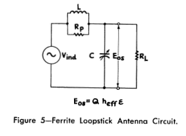

Complete Model
==============

Circuit Model of Solenoid Receiver
----------------------------------

Cheng et. al. investigated optimization of a solenoid type receiver coil for biomedical implants in order to create a WPT link. Lumped RLC model was seen in :numref:`circuit-model-1`. The model was valid at the frequency lower than the SRF of the coil :cite:`cheng2017:analytical`.

        : Lumped RLC model of a solenoid coil.

- :math:`L` : self-inductance of coil
- :math:`R_S` : the parasitic series resistance due to conductor’s ohm loss
- :math:`C_p` : parasitic capacitance
- :math:`R_p` : parasitic parallel resistance due to dielectric loss in the coating and tissue

.. rubric:: Series Resistance:

The parasitic series resistance was sum of the skin effect and proximity effect resistance. :math:`R_{sk}` and :math:`R_{pr}` were formed by Kelvin functions. 

.. math::
	:label: resistance

	R_S = R_{sk} + R_{pr}

.. rubric:: Inductance:

The self-inductance at high frequency was given :eq:`high-frequency-inductance` and the derivation was explained in paper.  

.. math::
        :label: high-frequency-inductance

	L = \mu_{eff} \pi r_{HF}^2 N^2 K_L K_P

.. rubric:: Capacitance and Parallel Resistance:

The parasitic parallel capacitance :math:`C_P` was proportional to the relative permittivity :math:`\epsilon_r` of the dielectric medium surrounding the solenoid. For a lossy dielectric medium, :math:`\epsilon_r` was a complex number. In other words, :math:`C_P` could be considered as a complex capacitance. The complex capacitance was represented by a real capacitance and a parallel resistance. The model in the study had a multidielectric medium and which was an extension of the uniform dielectric medium. 

.. math::
	:label: parasitic_cap_and_res

	C_P = Re\biggl( C_{Pco1} + \frac{C_{Pco2}C_{Pti}}{C_{Pco2}+C_{Pti}} \biggr) \\
	\frac{1}{R_P} = -\omega \cdot Im\biggl( C_{Pco1} + \frac{C_{Pco2}C_{Pti}}{C_{Pco2}+C_{Pti}} \biggr)

.. rubric:: Coil Impedance:

.. math::

	Z = \frac{1}{1/(R_S+j\omega L)+j\omega C_P + 1/R_P}\\

.. rubric:: Q-Factor:

.. math::

	Q = Im(Z)/Re(Z)

.. rubric:: Self Resonance Frequency:

The SRF could be obtained by finding the frequency in which :math:`Im(Z) = 0`.

Circuit Model of Loop Antennas
==============================

Cheng et. al. developed the circuit model of a solenoid coil as shown in :numref:`circuit-model-2019-analytical` with ferrite tube that regards to their previous work. This work was based on the analytical effective permeability model of the ferrite tube. Formulation of components were given. Coils which one has a hollow cylinder ferrite core and the other one has ferrite rod were measured and compared. In addition, measurements of inductance and impedance of coils were compared wtih different works :cite:`cheng:2019analytical`.  

        : (a) Diagram of the solenoidal Rx coil which is wound around a ferrite tube, coated with the biocompatible material, and implanted into the tissue. (b) Top view of the Rx coil and the ferrite tube. (c) Equivalent lumped model.

Model 2
-------

Simpson and Zhu investigated an analysis of the electrically small multi turn loop antenna with a spheroidal core and a full-wave analysis of a practical loop with a cylindrical core in 2005 and 2006 [Simpson, 2005, Simpson and Zhu, 2006].

        : Circuit model 2.

.. math::
	:label: RLC_cm2

	\begin{array}{c}
	R = \frac{R_0}{6\pi}\biggr( \frac{S_{coil}}{l^2} \biggl)^2 \left[ 1+(\mu_m - 1) F(\xi_0,\mu_m) \right]^2\\
	L = \mu_0 \mu_m (N/2a) S_{coil} F(\xi_0,\mu_m)\\
	C = \frac{\pi \epsilon_0}{25} \frac{b^2}{\sqrt{a^2-b^2}} \left[ 12K_1+\frac{1}{7}K_3 \right]
	\end{array}

Approximate values for the series inductance :math:`\Delta L=1.8 \ \mu H`, and shunt capacitance, :math:`\Delta C=25.1 \ pF`, were determined. 

Model 3
-------

Kazimierczuk et. al. investigated a circuit model of ferrite core inductors. The behavior of the model parameters vs frequency is considered [Kazimierczuk et. al., 1999]. 

        : Circuit model 3.

As shown in figures above all parameters of circuit model are constant and independent from frequency below 1 kHz.

        : Circuit model 3 graphics.

Model 4 - Air Core Solenoid
---------------------------

Fraga et. al. investigated the impedance of long solenoids. In the case of ac, their properties can be studied in terms of an equivalent circuit. When frequency is not too high so that the distributed capacitances have a negligible influence, this circuit is the series connection of a resistance R_s, and an inductance L_s, both parameters usually taking their dc values, and thus the impedance Z_s=R_s-iωL_s. They noted that corrections are needed for low and high frequencies [Fraga et. al., 1998]. 

        : Circuit model 4 graphics.

Model 5
-------

The ferrite rod antenna consists of a coil which can be modeled as an inductor that has various resistances in series due to the antenna losses. Together with a parallel capacitance the antenna forms a parallel RLC circuit as shown in figure 3 [Koskimaa, 2016].

        : Circuit model 5.

Inductance formula is [Koskimaa, 2016, Snelling, 1969]

.. math::
	:label: L_model_5

	L=\mu_0 \mu_{cer} N^2 \frac{A}{l_f}

Most of the capacitance in the circuit is due to the parallel capacitor. The coil itself has a small capacitance between individual turns and the total capacitance between all turns is

.. math::
	:label: C_model_5

	C=\frac{\pi^2 2 r_c \epsilon_0 \epsilon_r}{\cosh^{-1}\biggr( \frac{2r_w+d_w}{2r_w} \biggl)(N-1)}

where dw is the distance or gap between individual wires and r relative permittivity of the medium which in a tightly wound coil is the coating on the metal wire.
The resistances in the antenna are divided into ohmic losses and the radiation resistance. Ohmic losses in the antenna are caused by losses in the wire itself and losses in the ferrite core. Increased losses lead to the antenna being less sensitive at the resonant frequency. The half-power bandwidth also becomes wider [Koskimaa, 2016].

.. rubric:: Ferrite Core loss

Ferrite core is a lossy material that absorbs power from the magnetic field flowing through the coil. The magnitude of the ferrite loss depends on the material of the rod and the dimensions of both the wire coil and the rod. The equation for the ferrite loss is

.. math::
	:label: R_ferrite

	R_f = \omega \mu_0 \mu_{cer} \tan{\delta_m} N^2 \frac{A}{l_f}

Model 6 - Receiving Loaded Antenna
----------------------------------

        : Circuit model 6 [Laurent and Carvalho, 1962].

