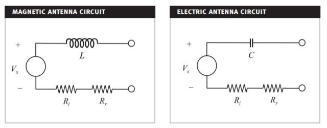

****************
Circuit Modeling
****************

The operation of the antenna can be analyzed by using an equivalent circuit. The ferrite rod antenna consists of a coil which can be modeled as an inductor that has various resistances in series due to the antenna losses. Together with a parallel capacitance the antenna forms a parallel RLC circuit. The RLC resonance frequency can be tuned by adjusting the capacitance of the capacitor. The impedance seen from the antenna terminals is the antenna impedance [Koskimaa, 2016]:

.. math::
	:label: Z_A

	Z_A = R_A + jX_A

        : Circuit models of magnetic and electric antennas.

.. toctree::

	complete-model
	coil-resistance
	coil-inductance
	coil-capacitance
	impedance-matching

