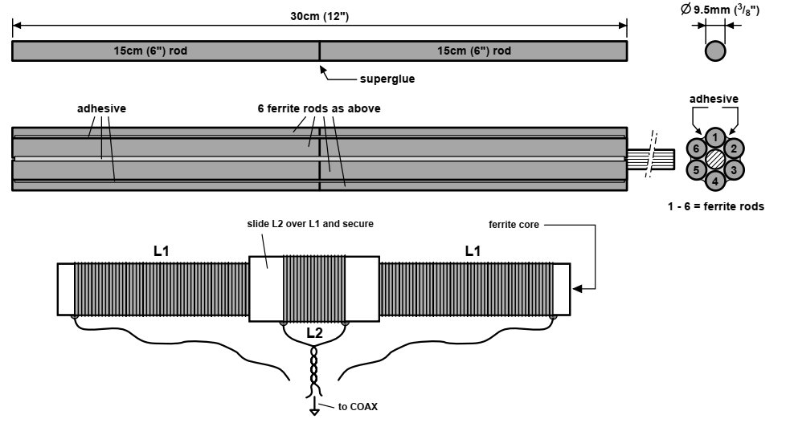
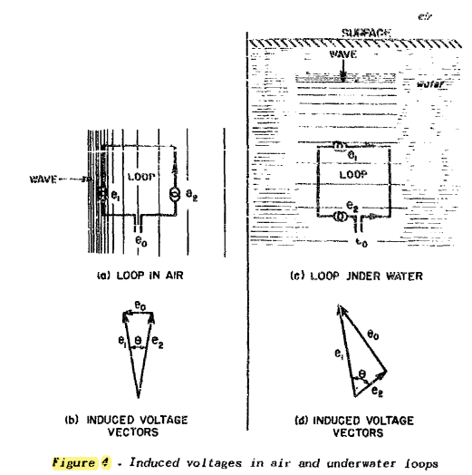
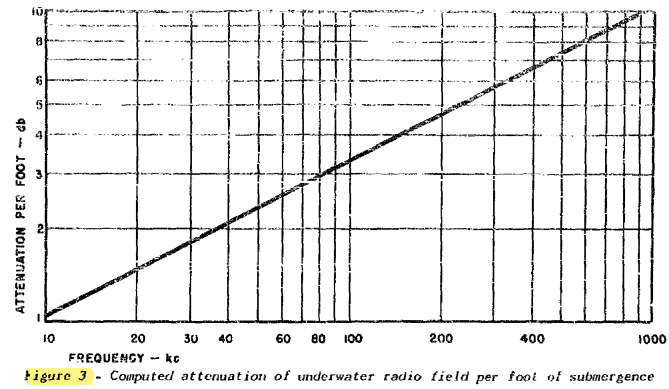
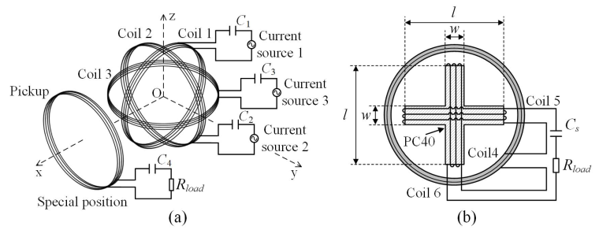

************
Applications
************

VLF & LF Antennas
=================

VLF (Very Low Frequency) Band take place from 3kHz to 30 kHz in the frequency spectrum :cite:`ekmekci:2004`.

.. list-table::
	:widths: 1 1
	:header-rows: 1
	
	*	- Advantages
		- Disadvantages
		
	*	- EM waves penetrate more than higher frequencies such as in the sea water
		- High background noise levels
	
	*	- Low atmospheric attenuation
		- Communication needs large amount of power at the output of the transmitter
	
	*	- Appropriate for long range communication
		- 
	*	- Diffract around objects that would block higher frequencies
		-
	*	- Less prone to multipath
		-

VLF antennas operate on VLF band. They are electrically small and this simplifies analysis. They are physically large structures. In other words, they generally have a number of towers that 200-300 m high and cover areas of up to a square kilometer or more. The VLF antennas support worldwide communication :cite:`ekmekci:2004`.

The VLF antennas have some problems that listed below :cite:`ekmekci:2004`:

- Bandwidth is less than 200 Hz.
- Small radiation resistance.
- They are expensive structures.
- Antenna system covers a large area.
- Designing an efficient transmitting antenna is difficult.
- High power levels are needed for transmission.

Marris produced a ferrite core loopstick antenna for receiving application as shown in :numref:`loopstick-ultima`. He said VLF antenna but operating frequency band is 50 kHz to 195 kHz, so it was a LF antenna. MMG F14 grade nickel-zinc material was used. The antenna compared with a traditional 20 x 1.25 cm diameter loopstick and he noted that increased signal strength and reduced noise :cite:`marris:1998ultima`. 

	: Loopstick antenna.

Underwater Loop Antennas
========================

In the first world war, some submarines were equipped with radio signal receivers called "French" coils. An American submarine underwater at Long Island Sound received long-wave signals from Nauen, Germany in 1919 :cite:`toth:1950`.

In 1941, Naval Research Laboratory presented a report which contains an investigation of a test that feasibility of receiving low frequency transmission signals while the receiving antennas completely submerged to the seawater. In order to determine this, it was necessary to make the following tests :cite:`isely:1941test`:

- The signal strength and signal to noise ratio received by various types of antennas at various depths and for various frequencies.
- The best type of coupling device (input transformer and tuning unit) to transfer the received signals from the antennas to the receiver equipment.

Other tests to obtain other relevant information are as follows :cite:`isely:1941test`:

- Underwater bearing of transmitter by null method.
- Q of loops.
- Effect of sea bottom on signals. 
- Noise survey of ship.

In the report, some important results were highlighted :cite:`isely:1941test`. 

- The depth of the sea bottom seems to have practically no effect of the strength of the signals. 
- Theoritical considerations of the design of a loop for underwater reception that a narrow loop with its long side parallel to the water surface is best. 
- Signals of 1000 microvolts per meter in air should be readable to a depth of 10 meters (34 feet)(above loop) in ocean water and 11.5 meters (38 feet)(above loop) in water of less salinity.

Toth and Fratianni investigated underwater loop reception and concluded that these results: a) Long-distance underwater radio receivers should be used in the range of 15-30 kHz and about maximum of 6 m (20 ft). b) A convenient underwater receiver system should be omnidirectional and at a certain distance from the water surface :cite:`toth:1950`.

Induced voltage at the terminals of the antenna in the air is a function of the time of the frontwave that comes to the opposite edge of the coil that parallel to the electric vector. A similar induced voltage occurs at a loop antenna under water. However, since the wavelength of underwater wave propagation is much slower (1000 times slower than air) and the attenuation is too high, the phase differences of the induced voltages at the coil edges are high as shown in :numref:`induced-voltage-underwater` :cite:`toth:1950`.

        : Induced voltages in air and underwater loops.

The operation of the loop antenna under water significantly increases the efficiency of receiving. For example, in a 20 kHz system, the output voltage increased by 1650 times or 64 dB. However, there are losses in the field strenght of about 66 dB. The loss of the output voltage is only about 2 dB in the transmissions from above the water surface to just below the water surface. :numref:`attenuation-of-underwater` shows the amount of loss per foot under water :cite:`toth:1950`.

        : Computed attenuation of underwater radio field per foot of submergence.

In 2011, Waheed-uz-Zaman and Yousufzai presented a study about a VLF transmitting antennas for submerged submarines :cite:`waheed:2011design`.

.. _Real-time Locating Systems:

Real-time Locating Systems
==========================

Real-time locating systems (RTLS) are used to automatically identify and track the location of objects or people in real time, usually within a building or other contained area. Wireless RTLS tags are attached to objects or worn by people, and in most RTLS, fixed reference points receive wireless signals from tags to determine their location. Examples of real-time locating systems include tracking automobiles through an assembly line, locating pallets of merchandise in a warehouse, or finding medical equipment in a hospital :cite:`wiki:realtimelocating`.

Schantz investigated an application of real-time locating system that operate at AM broadcast band (530-1710 kHz). Performance of QT-400 system of Q-Track company was discussed :cite:`schantz:2007real`. 

Richards et al. investigated omnidirectional transmitting loopstick antennas with ferrite core that operates low frequency band for RTLS. Simulations run under various parameters which were type of ferrite, form factor, coil covering factor, number of turns, wire gauge, wire spacing, and gap between coil and ferrite. Comparative results were not given in details. They noted that resistive losses in the coil of the loopstick antenna dominate over in the ferrite core like 5% was core and 95% was solenoid :cite:`richards:2010electrically`.

Near field channel model document is to provide IEEE P802.15 for evaluating near field location aware wireless systems :cite:`schantz:2004near`.

.. rubric:: Patents

.. list-table::
	:widths: 10 70 20
	:header-rows: 1
	
	*	- Year
		- Name
		- Patent Number
	
	*	- 2004
		- System and method for near-field electromagnetic ranging
		- US20040032363A1
	
	*	- 2005
		- System and method for near-field electromagnetic ranging
		- US6963301
	
	*	- 2014
		- Method of near-field electromagnetic ranging and location 
		- US20140062792A1

Radio Direction Finder
======================

A radio direction finder (RDF) is a device for finding the direction, or bearing, to a radio source. Using two or more measurements from different locations, the location of an unknown transmitter can be determined; alternately, using two or more measurements of known transmitters, the location of a vehicle can be determined. RDF is widely used as a radio navigation system, especially with boats and aircraft :cite:`wiki:radiodirection`.

In 1955, Hemphill investigated a magnetic radio compass antenna that the magnetic energy was picked up by the collector bars and conducted as magnetic energy to the small pickup coil in the center. Since the antenna was placed on the surface of the aircraft, it did not cause any additional drag :cite:`hemphill:1955magnetic`.

.. _magnetometer:

Magnetometer
============

A magnetometer or magnetic sensor is an instrument that measures magnetism either the magnetization of a magnetic material like a ferromagnet, or the direction, strength, or relative change of a magnetic field at a particular location :cite:`wiki:magnetometer`.

In 1962, Hill and Bostick presented a report about a magnetometer (with their own words micropulsation sensor) that had laminated mumetal core based on the resistance of winding and the character of the output signal. Aim of the design was a sensor with a lower impedance than the 1000 ohm source impedance. Therefore, the length and resistance of the coil in the sensor had been studied in detail. Within the core, eddy current and hysteresis losses and Within the winding, losses caused by skin effect, proximity effect, distributed capacity, and wire resistance were considered :cite:`hill:1962micropulsation`.

In 1977 an induction coil magnetometer that contains mumetal rod core, several partial coils, and a preamplifier circuit was patented. Critical dimensions of magnetometer that coil width to core width ratio, coil diameter to core diameter ratio, and core diameter to core length ratio were given. In addition, manufacturing of magnetometer was described in details. The invention was that increasing the resolution of the magnetometer :cite:`patent:1977magnetometer`.

.. list-table::
	:widths: 10 70 20
	:header-rows: 1
	
	*	- Year
		- Name
		- Patent Number
	
	*	- 1977
		- Magnetometer
		- DE2625964A1

	*	- 1985
		- Magnetisches Sondentripel
		- EP0154129B1
	

Magnetotelluric
---------------
.. Finished

Magnetotelluric is a device that measure the electric and magnetic fields arising from natural sources (electromagnetic sounding of the Earth) at the surface of the earth over broad frequency bands and is based upon the skin depth effect in conductive media. Stanley and Tinkler investigated a practical, low-noise coil system for magnetotellurics. Aim of the work was implementation of the magnetometer with low-cost, light weight, broad bandwidth, ease of construction and reliability. Manufacturing steps were given in detail. A chopper amplifier had been improved according to existing systems :cite:`stanley:1983practical`.

Wireless Power Transfer
=======================

Zhang et al. investigated a quadrature-shaped receiver (pickup) coil for omnidirectional wireless power transfer (WPT) as shown in :numref:`quadrature-shaped-pickup-zhang-2018`. A cross-shaped core is placed inside the receiver and the windings are wrapped around the core. Receiver is simulated for different geometric dimensions of the core and the results are presented in terms of both power and efficiency :cite:`zhang:2018optimal`.

    : Schematics of (a) omnidirectional WPT system and (b) quadrature-shaped pickup.

Biomedical Implants
===================

The environment in which biomedical implant devices are located is characterized by a *high dielectric permeability* and a *high loss factor* to disrupt the electromagnetic signal :cite:`turalchuk:2015electrically`.

Cheng et. al. investigated optimization of a solenoid type receiver coil for biomedical implants in order to create a WPT link. Analytical model of solenoid coil that includes the impact of tissue and coating around the coil was done. A four-turn coil had better results with 0.233 mm pitch at 700 MHz after a pitch optimization. An accurate formulation for the RLC model of implanted solenoid coil. The formulation was valid below self-resonance frequency of Rx coil :cite:`cheng2017:analytical`.

==== ================================================================
2015 Electrically small loop antennas for RFID applications
2017 Analytical modeling and optimization of small solenoid coils for 
     millimeter-sized biomedical implants
==== ================================================================

RFID
====

Turalchuk et al. investigated electrically small loop antennas for RFID applications. Two different condition were analyzed. Firstly, a receiving antenna was in the biological medium to link an implanted sensor and a transmitting (reader) antenna was outside of the medium. In this case, loops were operated in near-field zone in order to minimize effects of the dielectric properties of the biological medium. Secondly, a loop as a reader antenna for the identification of conventional tags in the far-field zone :cite:`turalchuk:2015electrically`.
 