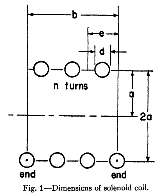

Coil Inductance
---------------

Air Core
^^^^^^^^

Wheeler gave simple inductance formulas for circular and square coils [Wheeler, 1982]. 

        : A circular or square coil.

.. list-table::
	:widths: 20 40 40
		
	*	- 
	 	- **Circular Coil**
		- **Square Coil**

		
	*	- **Simple**			
		- .. image:: ../img/ex4.png	
		- .. image:: ../img/ex5.png
	
	*	- **Short Coil**			
		- .. image:: ../img/ex6.png	
		- .. image:: ../img/ex7.png

	*	- **Long Coil**			
		- .. image:: ../img/ex8.png	
		- .. image:: ../img/ex9.png

Lundin gave a formula for the inductance of a single-layer circular coil or solenoid. He noted that a single-layer circular coil can be idealized to a cylindrical current sheet. If 2a<b then [Lundin, 1985]:

Air Core Solenoid
^^^^^^^^^^^^^^^^^

A simple chart as shown in Figure 1 presents the relation between inductance, over-all dimensions, and density of winding for a solenoid coil. Any one unknown may be determined if the other quantities are given. The chart is accurate for many turns of fine wire, close wound in a single layer. It is also accurate at low frequencies for one turn or many turns of thin ribbon, close-wound in a single layer [Wheeler, 1950]. 

        : Dimensions of solenoid coil.

        : Relation between inductance, over-all dimensions, and density of winding for a solenoid coil [Wheeler, 1950].

Self-inductance of solenoid is given by [Smythe, 1989]

.. math::
	:label: L_self

	L = \mu_0 \pi a^2 N^2 \frac{1}{\sqrt{l_s^2+a^2}-a}

where :math:`a` is radius of the loop or solenoid in meters, :math:`l_s` is length of solenoid in meters and :math:`N` is number of turns of the loop.

Inductance of solenoid air core for single layer [Burhans, 1979]:

.. math::
	:label: L_burhans

	L_h = \frac{0.2 d^2 N^2}{3d+9b}

where :math:`d` is diameter and :math:`b` is length in inches. Then, inductance of loop on core [Burhans, 1979]:

.. math::
	:label: L_burhans_core

	L_{cored} = \mu_{cer} L_h

Ferrite Core
^^^^^^^^^^^^

Devore and Bohley gave the inductance of coil formulation. They also noted that μ_r^''≪μ_r^' which is reasonable assumptions for long solenoids with low loss cores. [Devore and Bohley, 1977].

Jutty et. al. developed an equivalent model of inductors at high frequencies. 

        : Equivalent circuit of an inductor.

It is shown that an inductor behaves like a capacitor beyond its resonant frequency. The measured inductance L_S of an inductor with the effect of the capacitance included given by

.. math::
	:label: L_s_jutty

	L_s = \frac{L}{1-\omega^2 LC} = \frac{L}{1-(\omega/\omega_{res})^2}

Figure 1 shows the rod permeability as a function of the length to diameter ratio for the six materials available in rods. The inductance modifier is found in Figure 2. The ratio winding length divided by the rod length will give the inductance modifier. If the rod is totally wound the K=1. Shorter but centered winding will yield higher K values [Fair-Rite Rods Datasheet].

        : Rod permeability and inductance modifier.

To calculate the inductances of a wound rod the following formula can be used,

This formula was also given in Soft Ferrites book. [Snelling, 1969, Fair-Rite Rods Datasheet]

