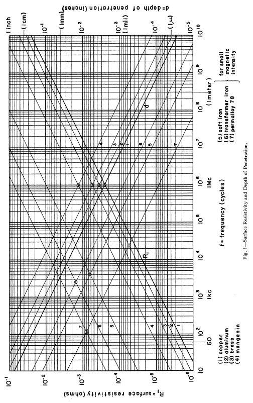

Coil Resistance
---------------

The resistances in the antenna are divided into ohmic losses and the radiation resistance. Ohmic losses in the antenna are caused by losses in the wire itself and losses in the ferrite core. Increased losses lead to the antenna being less sensitive at the resonant frequency. The half-power bandwidth also becomes wider [Koskimaa, 2016].

Witzig investigated high-frequency resistance of coils [Witzig, 1947]. 

.. math::
	:label: R_c

	R_c = K_\tau R_0 (0.38 d \sqrt{f} + 0.25)

K_τ is an empirical constant. When a coil is used at a frequency near its resonant frequency, its resistance is modified by its self-capacitance. This self-capacitance increases the circulating current flowing in the coil and hence gives rise to a greater coil loss. Apparent coil resistance can be shown as [Witzig, 1947] 

.. math::
	:label: R_c_res

	\begin{array}{c}
	R_c^{resonance} = \frac{R_c}{(1-\omega^2 L C_0)^2}\\
	C_0 = 4.55 \cdot 10^{-14} \frac{l_r}{\ln{0.72l_r/d_r}}
	\end{array}

.. rubric:: Wire Resistance with Skin and Proximity Effect

The **skin effect** is caused by eddy currents in the conductor. A current flowing in a conductor creates a magnetic field around it. Magnetic field induces circular eddy currents that oppose the change in the magnetic field. This leads to the eddy currents being in the opposite direction of the original current flow in the center of the conductor. Near the surface or skin of the conductor the eddy currents flow in the original current direction. Most of the current now flows near the conductor surface thus the effective conducting area is reduced. 

The surface resistance of a conductor is 

.. math::
	:label: R_surface

	R_s = \sqrt{\frac{\omega\mu}{2\sigma}}

For a wire with length lw and radius rw the wire resistance is 

.. math::
	:label: R_wire

	R_w = \frac{l_w}{2\pi r_w} \sqrt{\frac{\omega\mu}{2\sigma}}

For a coil with radius rc this becomes

.. math::
	:label: R_wire_2

	R_w = N \frac{r_c}{r_w} \sqrt{\frac{\omega\mu}{2\sigma}}

The **proximity effect** loss is similarly to the skin effect caused by eddy currents. The magnetic field created by a conductor induces eddy currents in nearby conductors.

.. math::
	:label: R_wire_3

	R_w = N \frac{r_c}{r_w} \sqrt{\frac{\omega\mu}{2\sigma}} \biggl( \frac{R_p}{R_0}+1 \biggr)

where the ratio R_p/R_0 is a factor of how much the total wire resistance is increased due to the proximity effect [Smith, 1971]. By knowing the easily calculated skin effect resistance, the proximity effect can be determined with other means such as simulations and measurements [Koskimaa, 2016].

.. rubric:: Skin Effect

Fig. 1 is a chart giving the surface resistivity R, and the depth of penetration d for various metals, over a wide range of frequency f [Wheeler, 1942].

        : Surface resistivity and the depth of penetration over a wide range of frequency.

