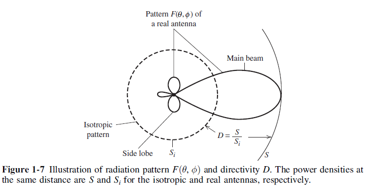
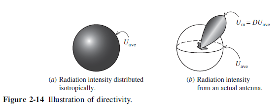
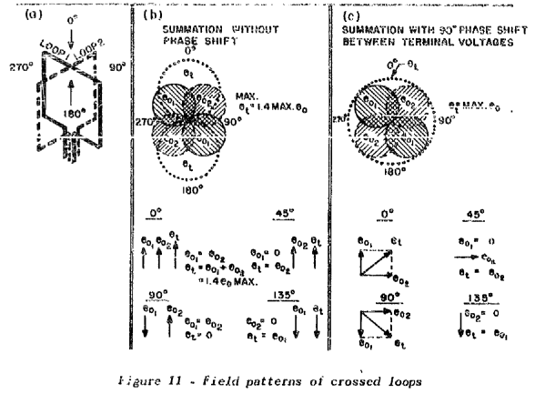
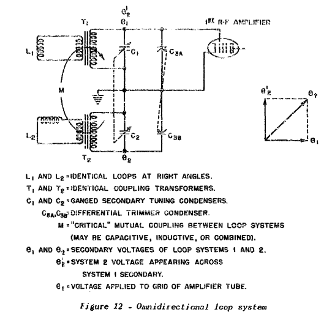
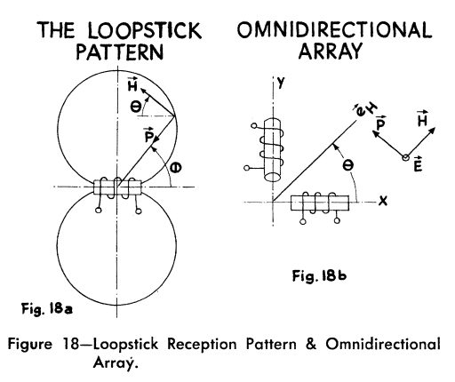

Directivity and Efficiency
--------------------------

One very important quantitative description of an antenna is how much it concentrates energy in one direction in preference to radiation in other directions. This characteristic of an antenna is called directivity and is equal to its gain if the antenna is 100% efficient.

**Directivity** is defined as the ratio of the radiation intensity in a certain direction to the average radiation intensity [Stutzman and Thiele, 2012]. Directivity of any small antenna can be assumed approximately equal to 3/2 :cite:`manteghi:2014study`.

        : Illustration of radiation pattern and directivity.

Directivity can be tied more directly to the pattern function. First, we define beam solid angle, :math:`\Omega_A`:

.. math::
	:label: omega_A

	\Omega_A = \iint_{sphere} \vert F(\theta,\phi)\vert^2 d\Omega

.. math::
	:label: D

	D = \frac{4\pi}{\Omega_A}

These results show that directivity is entirely determined by the pattern shape; it is independent of the details of the antenna hardware [Stutzman and Thiele, 2012].

        : Illustration of directivity.

The concept of directivity is illustrated in :numref:`illustration_of_directivity` [Stutzman and Thiele, 2012].

The *radiation efficiency* of an antenna is defined as the portion of power that is not absorbed in the antenna structure as ohmic losses. This is characterized by the :math:`R_{rad}` and the ohmic loss resistance, :math:`R_{loss}`, with which the radiation efficiency, :math:`\eta_r`, is [Koskimaa, 2016]

.. math::
	:label: eta_r

	\eta_r = \frac{R_{rad}}{R_{rad}+R_{loss}} = \frac{P_{rad}}{P_{in}} = \frac{P_{rad}}{P_{rad}+P_{loss}}

where :math:`P_{rad}` is the radiated power, :math:`P_{in}` is the power accepted by the antenna and :math:`P_{loss}` is the power loss in the antenna. The antenna has losses due to the impedance mismatch between the antenna output and feed input. The mismatch causes power reflection. The total efficiency of the antenna is defined as [Koskimaa, 2016]

.. math::
	:label: eta_t

	\eta_t = (1-\vert \Gamma \vert^2)\eta_r

These are used to define antenna gain, :math:`G`, and realized gain, :math:`G_{real}`, respectively [Koskimaa, 2016]:

.. math::
	:label: G

        \begin{array}{c}
	G = \eta_r
	G_{real} = \eta_t D
        \end{array}

Omnidirectivity
^^^^^^^^^^^^^^^

.. rst-class:: written

The two loop antennas are positioned perpendicular to each other to make the receiver omnidirectional. If a 90 degree electrical phase shift is added to the loop antennas, a circular antenna pattern is formed as shown in :numref:`omnidirectional-pattern` :cite:`toth:1950`.

        : Field patterns of crossed loops.

.. rst-class:: written

Electrical circuit of an omnidirectional loop antenna system is given by :numref:`omnidirectional-loop-system` :cite:`toth:1950`.

        : Electrical circuit of an omnidirectional loop antenna system.

.. rst-class:: check

In an application where omnidirectivity is required, two separate loop antennas located at right angles to each other can be used to give equal reception in all directions by introducing a 90 deg phase shift in one of the induced signals before they are combined [Laurent and Carvalho, 1962]. 

        : Loopstick Reception Pattern & Omnidirectional Array.

