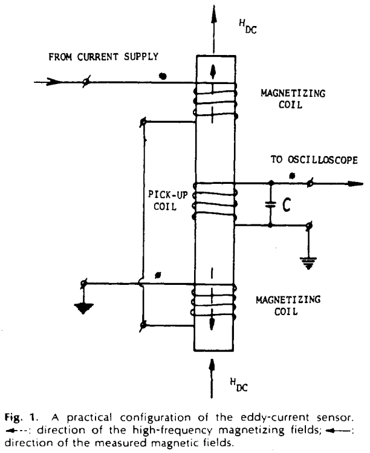

*************
Eddy Currents
*************

Multifield Eddy Current Effect
==============================

Rabinovici and Kaplan investigated an eddy current effect which occurs in nonlinear magnetic conductors excited by multiple alternating fields in 1983. The field penetrating into the material contains new magnetic fields whose frequencies is much lower than the frequencies of the exitation fields. They noted that this is due to the realtive cancellation (filtering) of the orginally high frequency fields by the screening of eddy currents :cite:`rabinovici:1983`.

In 1985, Kaplan and Rabinovici investigated an **eddy current sensor** for DC and low-frequency magnetic fields as shown in :numref:`eddy-current-sensor`. This new sensor based on multifield eddy current effects could measure fields with intensities about :math:`10^{-5}` Oe or Gauss :cite:`kaplan:1985`. 

    : Eddy current sensor.
