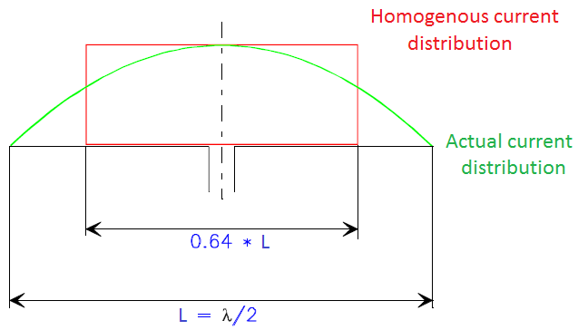

Effective Height (Length)
-------------------------

Effective height (or length) of an air core loop in meters is [Rohner, 2006]

.. math::
	:label: h_eff

	h_{eff} = \frac{ 2\pi A N }{ \lambda } = \frac{ \pi^2 D^2 N }{ 2\lambda }

For transmitter antenna, it is a length that a dipole homogeneously carrying the feed point current I_0 would have to have in order to generate the same field strength in the main direction of radiation as

.. math::
	:label: h_eff_int

	h_{eff} = \int_0^L \frac{ I(Z) }{ I_0 } dz

where :math:`I(z)` is the current distribution, :math:`I_0` is the feed point current (maximum). In the case of a half-wave dipole antenna (:math:`I(z)=I_0 \cos⁡ {2\pi L/ \lambda}), h_{eff}=\lambda/\pi=2L/\pi=0.64L`). This is shown :numref:`effective_height`.

        : Explanation of the effective length concept.

For receiver antenna, the effective height of the dipole antenna is [Laurent and Carvalho, 1962]

.. math::
	:label: h_eff_rx

	h_{eff} = \frac{v_{ind}}{E}
	h_{eff} = \frac{\omega_0 N A_r}{C} \left[ \mu_{cer} + \biggl( \frac{d_c^2}{d_r^2} - 1 \biggr) \right]

where :math:`\omega_0` is resonance frequency, :math:`N` is number of turns, :math:`A_r` is area of the rod, :math:`\mu_{cer}` is effective relative permeability of the rod, :math:`d_c` and :math:`d_r` are diameters of the coil and rod respectively[Laurent and Carvalho, 1962]. 

Therefore, for an N turn ferrite rod antenna, [Snelling, 1969]

.. math::
	:label: h_eff_snelling

	h_{eff} = \mu_{cer} \frac{\omega AN}{c_0} = \mu_{cer} \frac{2\pi AN}{\lambda_0}

Another effective height formula for ferrite loaded solenoid [Burhans, 1979]:

.. math::
	:label: h_eff_burhans

	h_{eff} =  \frac{2\pi AN \mu_{cer} F_a}{\lambda}

where :math:`F_a` is averaging factor of coil and rod (typically 0.5 to 0.7).

