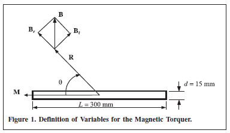

============
EM Modeling
============

Magnetic Dipole Moment
----------------------

Magnetic dipole moment is a vector that point out of the plane of the loop and the magnitude of moment for a static field equals to the product of the flowing current in and cross-sectional area of the loop.

.. figure:: ../img/magnetic_dipole_moment.png
        :align: center
        :scale: 100 %
        :name: magnetic_dipole_moment

        : Magnetic dipole moment equivalent of a loop.

.. role:: rewrite

:rewrite:`A comparison of magnetic and electric field components with those of the infinitesimal magnetic dipole indicates that they have similar forms. In fact, the electric and magnetic field components of an infinitesimal magnetic dipole of length l and constant “magnetic” spatial current` :math:`I_m` :rewrite:`are givenby`

.. math::
	:label: electric_field_components_magnetic_dipole
	
	\begin{aligned} 
	E_r &= 0 \\
	E_\theta &= 0 \\
	E_\phi &= -j \frac{ k I_m l \sin \theta}{4 \pi r} \left[ 1 + \frac{1}{jkr} \right] e^{-jkr}
	\end{aligned} 
	
.. math::
	:label: magnetic_field_components_magnetic_dipole
	
	\begin{aligned} 
	H_r &= \frac{I_m l \cos \theta}{2 \pi \eta r^2} \left[ 1 + \frac{1}{jkr} \right] e^{-jkr} \\ 
	H_\theta &= j \frac{ k I_m l \sin \theta}{4 \pi \eta r} \left[ 1 + \frac{1}{jkr} - \frac{1}{(kr)^2} \right] e^{-jkr} \\ 
	H_\phi &= 0 
	\end{aligned} 
	
:rewrite:`These can be obtained, using duality, from the fields of an infinitesimal electric dipole. When` :eq:`electric_field_components_magnetic_dipole` :rewrite:`and` :eq:`magnetic_field_components_magnetic_dipole` :rewrite:`are compared with magnetic and electric field components, they indicate that a magnetic dipole of magnetic moment` :math:`I_m l` :rewrite:`is equivalent to a small electric loop of radius a and constant electric current` :math:`I_0` :rewrite:`provided that`

.. math::
	:label: I_ml
	
	I_m l = j S \omega  \mu I_0
	
:rewrite:`where` :math:`S = \pi a^2` :rewrite:`(area of the loop). Thus, for analysis purposes, the small electric loop can be replaced by a small linear magnetic dipole of constant current. The magnetic dipole is directed along the z-axis which is also perpendicular to the plane of the loop.`

Loop analysis based on magnetic dipole moment is given in Electromagnetic Waves & Antennas - S. J.Orfanidis – 2008 book CH 15.
		
Time-Varying, Cored and N-Turn Loop Antenna
^^^^^^^^^^^^^^^^^^^^^^^^^^^^^^^^^^^^^^^^^^^

Dunbar noted that in order to increase the effective area artificially through the use of a permeable core and a multi-turn coil. It is quite successful provided the flux density is kept well below the saturation level. Thus, the effective area becomes :math:`NS\mu_{cer}` and magnetic dipole moment becomes [Dunbar, 1972]. This magnetic moment can be also used in a conductive medium.

.. math::
	:label: M_cored
	
	M = j \omega \mu_0 \mu_{cer} ISN
	
In order to quantify the magnetic moment for our rod antenna, we will compare its magnetic field to the magnetic field produced by an air core planar loop of current (i.e., :math:`IS`, where :math:`S` represents the loop area). Essentially, we will enforce the equivalence theorem to determine the necessary moment for an air core planar loop of current that will produce the same external magnetic field as our rod antenna. The magnetic moment will be determined by using the broadside magnetic field component [Jordan et.al., 2009].

.. figure:: ../img/maximum_magnetic_moment_and_gain.png
	:align: center
	:scale: 100 %
	:name: maximum_magnetic_moment_and_gain

	: Maximum magnetic moment and gain versus the coil width/rod length percentage [Jordan et.al., 2009].

:rewrite:`The electromagnetic field of the ferrite-loaded transmitting loop is given by Eq 5-1 to 5-3 with the moment` :math:`m=\mu_rod F_v I_o NA`. :rewrite:`The ferrite-loaded loop, however, is seldom used as a transmitting antenna because of the problems associated with the nonlinearity and the dissipation in the ferrite at high magnetic field strengths` [Antenna Engineering Handbook 3Ed - R.C.Johnson H.Jasik – 1993, p5-9].

Static, Cored and N-Turn Loop Antenna
^^^^^^^^^^^^^^^^^^^^^^^^^^^^^^^^^^^^^

Devore and Bohley noted that magnetic dipole moment of a ferrite loaded loop has two component that magnetic dipole moment of ferrite core and winding [Devore Bohley, 1977]. 

.. math::
	:label: M_db
	
	M = M_F + M_w

.. math::
	:label: M_w_and_M_F
	
	\begin{aligned}
	M_w &= NIS \cong NIV/l \\
	M_F &= (\mu - 1) H_F V_F
	\end{aligned}

where

.. math::
	:label: M_w_and_M_F_var
	
	\begin{array}{c}
	H_F = \frac{H_0}{1+ D_F (\mu - 1)} \\
	H_0 \approx H_w = \frac{n}{l_w} (1-D_F) I \\ 
	V_F = l_F \pi {a_F}^2
	\end{array}

Torquer
^^^^^^^

	: Torquer.

The definition of variables for the magnetic torquer is as shown in :numref:`torquer`, where :math:`M` represents the dipole moment of the torquer, :math:`\theta` is the angle with respect to the torquer axis, :math:`R` is the distance from the center of the coil, and :math:`l` is the effective coil length. Also, :math:`B` is the magnetic-flux density, :math:`B_r` and :math:`B_t` are the radial and tangential components of :math:`B`, respectively [Lee et. al., 2002].

If :math:`\theta = 90^\circ`,

.. math::
	:label: M_torquer_90
	
	M = \frac{4 \pi}{\mu_0} \biggl( R^2 + \frac{L^2}{4} \biggr)^{3/2} B_t

If :math:`\theta = 0^\circ`,

.. math::
	:label: M_torquer_0

	M = \frac{4 \pi}{\mu_0} \frac{1}{\frac{\frac{R}{L} - \frac{1}{2}}{(R^2 - RL + \frac{L^2}{4})^3/2} - \frac{\frac{R}{L} + \frac{1}{2}}{(R^2 + RL + \frac{L^2}{4})^3/2}} B_r

Mehrjardi and Mirshams noted that an equation of magnetic dipole moment [Mehrjardi and Mirshams, 2010]

.. math::
	:label: M_Mehrjardi
	
	M = \mu_{cer} NSI
	
Radiation Resistance
--------------------

As the energy lost on the ohmic resistance transforms into heat, the energy that is lost in the radiation resistance turns into electromagnetic radiation.

A ferrite core in the loop that tends to increase the magnetic flux, the magnetic field, the open-circuit voltage, and in turn the antenna efficiency of the loop. 

The radiation resistance of the ferrite loop is given by

.. math::
	:label: R_rad_f_1
	
	R_{rad}^{ferrite} =  R_{rad}^{air} \biggl(\frac{\mu_{ce}}{\mu_0}\biggr)^2 = R_{rad}^{air} {\mu_{cer}}^2

where :math:`R_{rad}^{ferrite}` is radiation resistance of ferrite loop, :math:`R_{rad}^{air}` is radiation resistance of air core loop, :math:`\mu_{ce}` is effective permeability of ferrite core, :math:`\mu_0 = 4\pi 10^-7 H/m` is permeability of free space, :math:`\mu_{cer}` is relative effective permeability of ferrite core.

Radiation resistance of N-turn, air cored loop is given by

.. math::
	:label: R_rad_air
	
	R_{rad}^{air} = 20 \pi^2 N^2 \biggl( \frac{C}{\lambda} \biggr)^4 \cong 31.171 \biggl( \frac{A^2}{\lambda^4} \biggr)

where :math:`C = 2 \pi a` is circumference of the loop [m], :math:`A = \pi a^2` is area of the loop [m] ,:math:`a` is radius of the loop [m], :math:`\lambda = c/f` is wavelength [m], :math:`c = 3 \cdot 10^8 m/s` is speed of light, :math:`f` is frequency [Hz], and :math:`N` is number of turns of the loop.

The relation is about 2 percent in error when the loop perimeter is λ/3. A circular loop of this perimeter has a diameter of about λ/10 [Kraus, 1988].

Using radiation resistance of air core loop equation and for an N-turn loop [Balanis, 2005, Rumsey and Weeks, 1956]

.. math::
	:label: R_rad_f_2
	
	R_{rad}^{ferrite} = 20 \pi^2 N^2 \mu_{cer}^2 \biggl( \frac{C}{\lambda} \biggr)^4

In order to determine the radiation resistance of a ferrite core, it is necessary to find the relative effective magnetic permeability of the ferrite core ( :math:`\mu_{cer}` ). Other variables are known geometrical and electrical properties.

Relative effective permeability
^^^^^^^^^^^^^^^^^^^^^^^^^^^^^^^

A simple model of the relative effective permeability of the ferrite core :math:`\mu_{cer}` is related to the relative permeability of the unbounded ferrite material :math:`\mu_r = \mu / \mu_0` by :cite:`balanis:2005`

.. math::
	:label: mu_cer_simple
	
	\mu_{cer} = \frac{\mu_r}{1 + D_F (\mu_r - 1)}

where :math:`D_F` is demagnetization factor of ferrite core.

For most ferrite material, :math:`\mu_r` is very large ( :math:`\mu_r \gg 1` ) so that :math:`\mu_{cer}` is approximately inversely proportional to the demagnetization factor:

.. math::
	:label: mu_cer_approx
	
	\mu_{cer} \cong D_F^{-1}

Devore and Bohley mentioned that a improved model of relative effective permeability in the equation of radiation resistance [Devore ve Bohley, 1977].

.. math::
	:label: mu_cer_improved
	
	\mu_{cer} = 1 + \frac{(\mu_r - 1) (1 - D_w) \frac{l_F}{l_w} ( \frac{a_F}{a_w} )^2}{1 + D_F ( \mu_r - 1)}
	
where :math:`D_w` is demagnetization factor of winding, :math:`l_F` is length of ferrite core, :math:`l_w` is length of winding, :math:`a_F` is cross section area of ferrite core, and :math:`a_w` is cross section area of winding.

