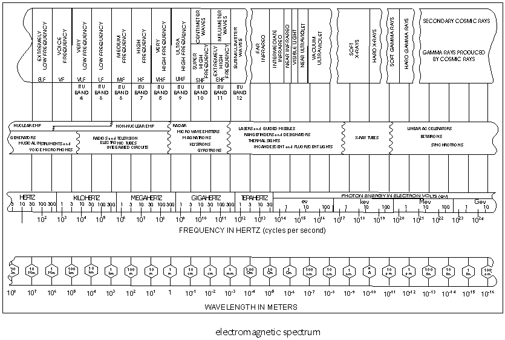

============
Fundamentals
============

.. contents:: Table of Contents

Radiation Integrals and Auxiliary Potential Functions
-----------------------------------------------------

The Vector Potential A for an Electric Current Source J
^^^^^^^^^^^^^^^^^^^^^^^^^^^^^^^^^^^^^^^^^^^^^^^^^^^^^^^

The vector potential A is useful in solving for the EM field generated by a given harmonic electric current :math:`J`. The magnetic flux :math:`B` is always solenoidal; that is, :math:`\nabla \cdot B = 0`.

Therefore, it can be represented as the curl of another vector because it obeys the vector identity

.. math::
    :label: curl of another vector 
	
	\nabla \cdot \nabla \times A = 0
	
where :math:`A` is an arbitrary vector. Thus we define

.. math::
    :label: arbitrary vector1 
	
	B_A = \mu H_A = \nabla \times A
	
or

.. math::
    :label: H_A 

	H_A = \frac{1}{\mu} \nabla \times A
	
Equating Maxwell’s equation

.. math::
    :label: maxwells1
	
	\nabla \times H_A = J + j \omega \epsilon E_A

.. math::
    :label: maxwells2
	
	E_A = -j \omega A - j \frac{1}{j \omega \mu \epsilon} \nabla (\nabla \cdot A)

Once :math:`A` is known, :math:`H_A` can be found from :eq:`H_A` and :math:`E_A` from :eq:`maxwells2`. :math:`E_A` can just as easily be found from Maxwell’s equation :eq:`maxwells1` with :math:`J=0`. It will be shown later how to find :math:`A` in terms of the current density :math:`J`.

When loop current varies sinusoidally, all the electromagnetic field components about the dipole are proportional to the dipole moment. These fields vary with distance :math:`R` as :math:`k^2/R` for the radiation field components, as :math:`k/R^2` for the transition field components, and as :math:`I/R^3` for the induction field components, where :math:`k=2π/ \lambda`. Given the wavelength :math:`\lambda`, and any one of the three field components, the remaining components may be calculated. Alternately, given dipole moment and frequency, all three field components may be calculated :cite:`stewart:1958`.

Electromagnetic spectrum
------------------------

The electromagnetic spectrum is the range of frequencies (the spectrum) of electromagnetic radiation and their respective wavelengths and photon energies :cite:`wiki:electromagnetic`.

	: Electromagnetic Spectrum.

Antenna Types
-------------

Wire Antennas
^^^^^^^^^^^^^

.. list-table::
	:widths: 80 20

	*	- **Short Dipole**
			
		  The simplest of all antennas. It is simply an open-circuited wire, fed at its center
		  The words "short" or "small" imply "relative to a wavelength" size of the dipole antenna does not matter.
		  
	 	- .. image:: ../img/at-shortdipole.jpg
			:width: 100px
			:align: center	
		
	
	*	- **Dipole**
			
		  Two monopoles facing away from each other
		  Used to greate a powerful signal in restricted space	
	
	 	- .. image:: ../img/at-dipole.png
			:width: 100px
			:align: center
			
			
	*	- **Half-Wave Dipole**
			
		  Special case of the dipole antenna
		  Length of this dipole antenna is equal to a half-wavelength	
	
		- .. image:: ../img/at-halfwavedipole.gif
			:width: 100px
			:align: center
			

	*	- **Broadband (Wideband) Dipoles**
			
		  Broadband by increasing the radius A of the dipole	
	
	 	- .. image:: ../img/at-broadbanddipole.png
			:width: 100px
			:align: center
			
	
	*	- **Monopole (Whip)**
			
		  Works best for narrow range and can be collapsible
		  Used on small radios and vehicles	
	
	 	- .. image:: ../img/at-monopole.png
			:width: 100px
			:align: center
			

	*	- **Folded Dipole**
			
		  Folded dipole forms a closed loop		
	
	 	- .. image:: ../img/at-folded-dipole.png
			:width: 100px
			:align: center
			

	*	- **Loop**
			
		  Works like a dipole and reach multiple frequencies.
		  Commonly used for TV and RFID systems	
	
	 	- .. image:: ../img/at-loop.png
			:width: 100px
			:align: center
			
	
	*	- **Cloverleaf**
			
		  Circularly polarized wire antenna, with a radiation pattern similar to a dipole antenna
		  peak radiation direction broadside to the antenna. The antenna has nulls (very little radiation) in the axial direction
		  
		- .. image:: ../img/at-cloverleaf.png
			:width: 100px
			:align: center
			
			
Log-Periodic Antennas
^^^^^^^^^^^^^^^^^^^^^

.. list-table::
	:widths: 80 20

	*	- **Bow Tie**
			
		  Another type of dipole.
		  Angles can be set to work well with different frequencies. 
		  Similar radiation pattern to the dipole antenna, and will have vertical polarization

	
	 	- .. image:: ../img/at-bowtie.png
			:width: 100px
			:align: center

			
	*	- **Log-Periodic Tooth**
			
			
	 	- .. image:: ../img/at-LPtooth.gif
			:width: 100px
			:align: center			

			
	*	- **Log-Periodic Dipole Array (LPDA)**
	
	
	 	- .. image:: ../img/at-logperiodic.png
			:width: 100px
			:align: center
			
			
Aperture Antennas
^^^^^^^^^^^^^^^^^

.. list-table::
	:widths: 80 20
			
	*	- **Slot**			
			
	 	- .. image:: ../img/at-slot.png
			:width: 100px
			:align: center			
			
			
	*	- **Cavity-Backed Slot**			
			
	 	- .. image:: ../img/at-cavitybackedslot.png
			:width: 100px
			:align: center			
		
		
	*	- **Inverted-F**			
			
	 	- .. image:: ../img/at-invertedf.png
			:width: 100px
			:align: center			
		
		
	*	- **Slotted Waveguide**
			
	 	- .. image:: ../img/at-slottedwaveguide.jpg
			:width: 100px
			:align: center			
		
		
	*	- **Horn**			
			
	 	- .. image:: ../img/at-horn.png
			:width: 100px
			:align: center			
		
		
	*	- **Vivaldi**			
			
	 	- .. image:: ../img/at-vivaldi.gif
			:width: 100px
			:align: center			
		
		
	*	- **Telescopes (Eye)**			
			
	 	- .. image:: ../img/at-eye-antenna.gif
			:width: 100px
			:align: center			

Travelling Wave Antennas
^^^^^^^^^^^^^^^^^^^^^^^^

.. list-table::
	:widths: 80 20
		
	*	- **Helical**			
			
	 	- .. image:: ../img/at-helical.jpg
			:width: 100px
			:align: center	
					
		
	*	- **Yagi-Uda**
	
		  Ideal for long distance directional applications
		  Can reach multiple frequencies

	 	- .. image:: ../img/at-yagiuda.png
			:width: 100px
			:align: center	
					
		
	*	- **Spiral**			
			
	 	- .. image:: ../img/at-spiral.png
			:width: 100px
			:align: center	
			
Reflector Antennas
^^^^^^^^^^^^^^^^^^

.. list-table::
	:widths: 80 20

		
	*	- **Corner Reflector**			
			
	 	- .. image:: ../img/at-corner.jpg
			:width: 100px
			:align: center

		
	*	- **Parabolic Reflector (Dish)**			
			
	 	- .. image:: ../img/at-dish.png
			:width: 100px
			:align: center			
	
Microstrip Antennas
^^^^^^^^^^^^^^^^^^^

.. list-table::
	:widths: 80 20
	
			
	*	- **Rectangular Microstrip (Patch)**			
			
	 	- .. image:: ../img/at-patch.png
			:width: 100px
			:align: center
			
					
	*	- **Planar Inverted-F (PIFA)**			
			
	 	- .. image:: ../img/at-printedinvertedf.png
			:width: 100px
			:align: center
	
Other Antennas
^^^^^^^^^^^^^^

.. list-table::
	:widths: 80 20
	
		
	*	- **NFC**			
			
	 	- .. image:: ../img/at-nfc.png
			:width: 100px
			:align: center

		
	*	- **Fractal**			
			
	 	- .. image:: ../img/at-fractal.png
			:width: 100px
			:align: center

		
	*	- **Wearable**			
			
	 	- .. image:: ../img/at-wearable.png
			:width: 100px
			:align: center

.. _Magnetic Testing:

Magnetic Testing
----------------

There is a standart about expressing symbols and definitions relating to magnetic testing. Dictionary style definitions of terms are good orginized and some important notes clarify complicated issues :cite:`astm340-18:2018`.  