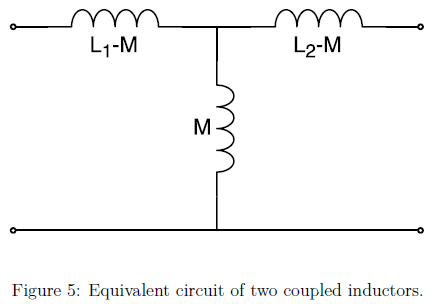

Impedance Matching
------------------

The impedance in the antenna’s main RLC circuit is not well matched to 50 :math:`\Omega`. The induced voltage is highly reflected if connected directly to a 50 :math:`\Omega` input. One way to improve the matching is to use a secondary coil or a so called pick-up coil next to the main coil [Koskimaa, 2016].

Pick-up Coil
^^^^^^^^^^^^

The pick-up coil will act as an impedance transformer. The impedance transformer transforms the main coil impedance and voltage into the secondary coil according to the equation

.. math::
	:label: pick-up coil

	\frac{N_2}{N_1} = \frac{U_2}{U_1} = \sqrt{\frac{Z_2}{Z_1}}

When the pick-up works as intended the output voltage from the decreased secondary coil voltage is still higher than the original main coil output voltage due to the improved matching.

When inductors are coupled a current change in one inductor induces a voltage in the second inductor. The mutual inductance between the inductors is defined as

.. math::
	:label: M_ind

	M = k \sqrt{L_1 L_2}

where k is the coupling coefficient. The equivalent circuit of two coupled inductors is a T-circuit shown in figure below.

        : Equivalent circuit of two coupled inductors.

The voltage over the two coils can be expressed with the mutual inductance as the following:

.. math::
	:label: U1_U2

	\begin{array}{c}
	U_1 = j \omega (L_1 I_1 + M I_2)\\
	U_2 = j \omega (M_1 I_1 + L_2 I_2)
	\end{array}

The coupling coefficient of the two coils can be measured by changing the secondary coil from open circuit to shorted and observing the change in the resonant frequency. When the second coil is shorted the voltage in the secondary coil becomes zero and the current will be

.. math::
	:label: I_2

	I_2 = -\frac{MI_1}{L_2}

By inserting this into the voltage equation of the primary coil in equation U1_U2

.. math::
	:label: U_1

	U_1 = j\omega L_s I_1

where L_s is the apparent/measured inductance over the primary coil when the secondary coil is shorted. Now the mutual inductance squared can be written as

.. math::
	:label: M2

	M^2 = L_2 (L_1 - L_s)

Using this the coupling coefficient becomes

.. math::
	:label: k

	k = \frac{M}{\sqrt{L_1 L_2}} = \sqrt{1-\frac{L_s}{L_1}} = \sqrt{1-\biggl(  \frac{f_0}{f_s} \biggr)^2}

where f_0 and f_s are the resonance frequencies related to the inductances L_1 and L_s according to resonance frequency of the RLC with the secondary coil open and shorted, respectively.

The impedance at the antenna output is Z_2. A portion of the pick-up voltage U_2 is reflected at the antenna output according to equation

.. math::
	:label: antenna_output

	\Gamma = \frac{Z_L - Z_2}{Z_L + Z_2}

where the load impedance is 50 :math:`\Omega`. The output voltage of the antenna is [Koskimaa, 2016]

.. math::
	:label: U_out

	U_{out} = (1-\Gamma)U_2

