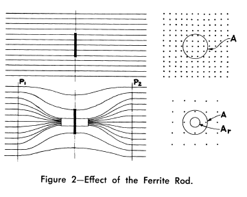
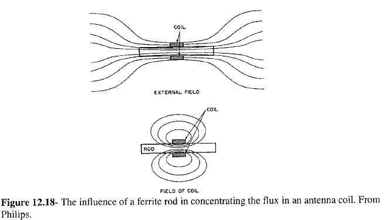
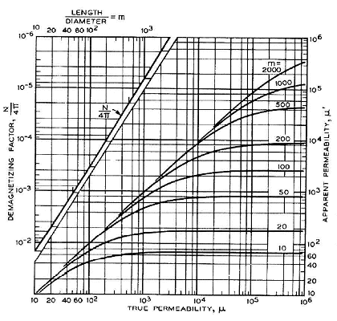
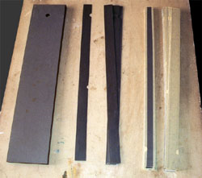
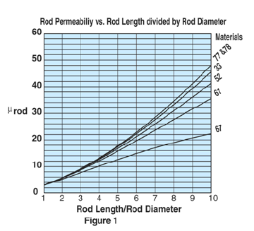
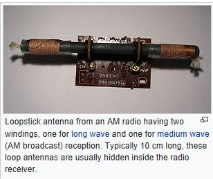
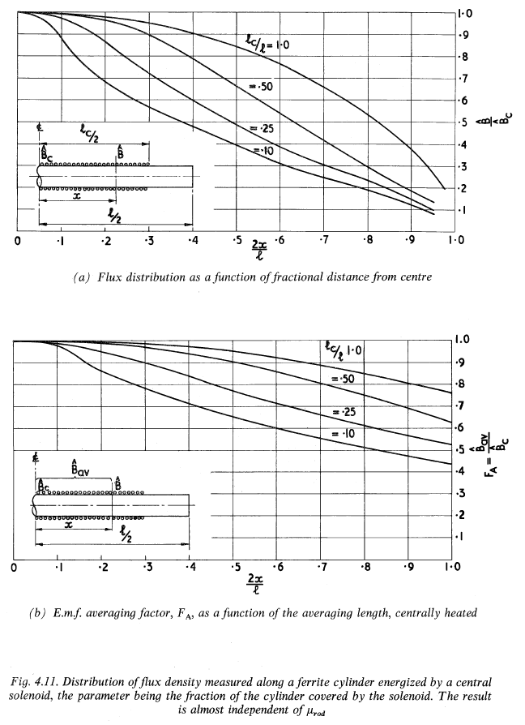
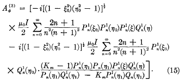
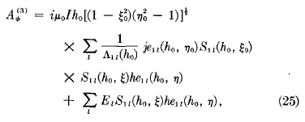
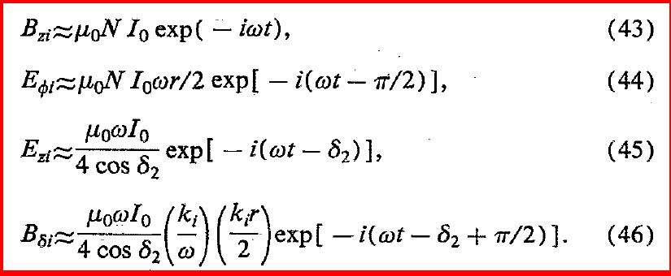

============
Loaded Loops
============

Introduction
------------

Ferrite core electrically small loops are often used for receiving signals, such as in radios and pagers, where the signal to noise ratio is much important than efficiency. 

        : Effect of the ferrite rod [Laurent and Carvalho, 1962].

        : Influence of a ferrite rod [Alex Goldman-Modern Ferrite Technology-Springer (2010) p305].

Eshraghian et al. (1982), Ranasinghe (2007), and Cole et al. (2003) show that without the magnetic core the coupling volume of a long solenoid is just the physical volume, but when a magnetic core is inserted, the coupling volume increases by a factor equal to the effective permeability of the magnetic core [Serkan Aksoy, Mail, 10.08.2017].

The loops are rarely used as transmitting antennas above low levels of power due to their poor radiation efficiency (low radiation resistance). As transmitting antennas, they become less significant below 30 MHz. If the efficiency is not an issue and power levels are very low, they are used as a transmitter. Because they would soon become very hot when any reasonable levels of power are fed into them, they must be cooled (for example by water as in torpedo transmitter).

As an exception, a tuned transmitting loop, can be equipped with a remotely controlled capacitor to make a resonant circuit, is used to transmit waves. However, such loops have to be retuned whenever the frequency is changed (even in the same operating band) because they are extremely narrowband. Nonetheless, they are sometimes the only practicable option for transmission when space is restricted [Serkan Aksoy, Mail, 01.06.2017].

.. rubric:: The Core

The great sensitivity of Induction coils is due to the high magnetic permeability of the material used to build the core. This material can be very expensive (try to search for mu-metal or permalloy on internet and you'll see!). But first of all we must consider the propriety of this coils in order to correctly dimension our project and get the best performances from our   expensive metal. 

        : Permeability of core [http://www.vlf.it/matteobruna/ULF_Induction-Coil.htm].

When we construct coils like these we must consider that they haven't an ideal behavior. The graph on the left shows that the apparent magnetic permeability of a cylindrical core can be different from the magnetic permeability of the metal of which is made. In fact the apparent permeability depends on the geometric dimensions of the core, in particular on the lenght-to-diameter ratio. So before buying the metal for the core we must ensure that we can made the core with the right lenght-to-diameter ratio to get from it all the permeability that can give.

The metal I choose for my coil's core is magnetic steel used for the construction of electrical transformers. It has a permeability around 1000, so I built the core with a lenght-to-diameter ratio around 50.

A variable magnetic field in a conductor material makes currents to flow. These are called Foucault's currents and will surely flow also in our core absorbing part of the signal we want to receive. There is no possibility to eliminate this phenomenon, but it can be limited. The only way is to "cut" this currents by using materials with a high internal resistance (composite alloys) or to build the core with many little pieces of metal (bars or laminations) insulated from each other. The magnetic steel I used is sell in insulated foils, so, to build my core, I simply put many of these together trying to obtain a cylindrical shape to completely fill the free space inside the coil. The procedure is also well shown by Hans Michlmair in his article .

        : core-lamination-sheets [http://www.vlf.it/matteobruna/ULF_Induction-Coil.htm].

To save money I got the magnetic steel from the discards of a transformers factory. Naturally it wasn't already in the right shape so I had to cut it in order to get foils narrow enough to fill the core's volume. At the end were composed four bars with a diameter of 4.5 cm and 70 cm long, that linked together forms a core of about 280 cm, so, with a lenght-to-diameter ratio of about 56 [http://www.vlf.it/matteobruna/ULF_Induction-Coil.htm].

Dimensions
^^^^^^^^^^

Frequency
^^^^^^^^^

Above 20 MHz or so, ferrite losses increase to the extent that ferrite loops may not be as good as air loops; relatively loss-free ferrites at higher frequencies tend to have low permeability and hence the slight advantage obtained with ferrites at low frequencies tends to disappear [Stewart, 1958].
At a moderate distance R from the dipole, provided R is large compared to dipole dimensions, and in the static case (that is, in the audio frequency region), k/R2 and k2/R are very small relative to l/R3 and hence can be ignored by comparison. This permits a static measurement of magnetic field intensity to be made in order to find dipole moment. Then radiation at some radio frequency can be determined providing that the dipole moment does not change from static to radio frequencies and providing the dipole is small enough to still be considered an elementary dipole at the radio frequency of interest [Stewart, 1958].

Measurement
^^^^^^^^^^^

Direct radio-frequency measurements usually require that the magnetic dipole antenna be electrostatically shielded; otherwise, incidental electric dipole radiation makes it almost impossible to separate radiation into electric and magnetic types. With static magnetic measurements of a radio-frequency antenna, on the other hand, antenna inductance is so small that no appreciable voltage is required to obtain antenna driving current and hence no significant electric dipole moment exists [Stewart, 1958].

An unshielded magnetic dipole at radio frequencies will radiate to a certain extent as an electric dipole. As a result, radiated power will exceed that calculated for magnetic dipole radiation alone. Electric dipole radiation typically affects radiation intensity most where the magnetic dipole radiation is a minimum; in the case of the loop, the major effect is to fill in the nulls. Magnetostatic measurements cannot account for electric dipole radiation; hence, magnetostatically predicted radio-frequency radiation resistance may be somewhat less than actual radiation resistance if the magnetic-type antenna is unshielded [Stewart, 1958].

Permeability (Influence of High-Frequency Magnetic Fields)
^^^^^^^^^^^^^^^^^^^^^^^^^^^^^^^^^^^^^^^^^^^^^^^^^^^^^^^^^^

The reaction of the magnetic induction B (and thus also of the magnetization) on an external alternating magnetic field H with a time dependence can be expressed as:

.. math::
	:label: BH

	\begin{array}{c}
	B=B_0 e^{i(\omega t - \delta)}\\
	H=H_0 e^{i\omega t}
	\end{array}

As a consequence the permeability  :math:`\mu` becomes complex:

.. math::
	:label: mu1

	\mu = \frac{B}{H} = \frac{B_0 e^{i(\omega t - \delta)}}{H_0 e^{i\omega t}} = \frac{B_0}{H_0}e^{-i\delta}

Using :math:`e^{-i\delta}=\cos⁡{\delta}-i \sin⁡{\delta}`  we get:

.. math::
	:label: mu2

	\mu = \frac{B_0}{H_0}\cos⁡{\delta} - i \frac{B_0}{H_0}\sin{\delta}

Characterizing the real and negative imaginary part of the permeability by:

.. math::
	:label: mu3

	\begin{array}{c}
	\mu'=\frac{B_0}{H_0}\cos⁡{\delta}\\
	\mu''=\frac{B_0}{H_0}\sin{\delta}
	\end{array}

we obtain [Fundamentals of magnetism - M.Getzlaff – 2008, p.139]:

.. math::
	:label: mu4

	\mu = \mu' -i\mu''

Due to the finite size of the ferrite rods, the effective permeability of the rod decreases near the ends of the solenoid. As a consequence of this, the inductance of the solenoid does not always grow as the square of the number of turns, as would be expected [Serkan Aksoy, Mail, 15.03.2017].

Figure 1 shows the rod permeability as a function of the length to diameter ratio for the six materials available in rods [Fair-Rite Rods Datasheet].

        : Rod permeability [fair-rite-datasheet].

Two Winding Solenoid
^^^^^^^^^^^^^^^^^^^^

        : Two winding solenoid.

Loopstick antenna from an AM radio having two windings, one for long wave and one for medium wave (AM broadcast) reception. Typically, 10 cm long, these loop antennas are usually hidden inside the radio receiver [Serkan Aksoy, Mail, 03.04.2017]. 

In the contra-wound configuration, introduced by the US Army Signal Corp many years ago and described in publications by Burhans and by Cornell, the coil wound on the ferrite rod is split into two equal parts wound withopposite sense. If the "outside" ends of these coils are grounded, a single-ended signal can be taken from the midpoint of the coil resulting in muchsimplified preamp design. Also, since the total coil inductance is halved (the half-coils would be in parallel), for a given required total inductance the number of turns can be increased providing increased sensitivity. (The total self-capacity of the windings is increased but ordinarily such would not be of principal concern.) [Serkan Aksoy, Mail, 29.07.2017] 

Notes
^^^^^

Mark 48 torpedo

Unconfirmed reports indicate that the torpedo's sensors can monitor surrounding electrical and magnetic fields. This may refer to the electromagnetic coils on the warhead (at least from 1977 to 1981), used to sense the metallic mass of the ship's hull and detonate at the proper stand-off distance [Serkan Aksoy, Mail, 08.04.2017].

A magnetic fuze reacts to the variable magnetic field of a ship is necessary for the most successful position of detonation under the keel of the ship. Work on this aspect of the bomb was found to be far from complete. The susceptibility to disturbances and the reaction capacity of such fuzes had not been investigated thoroughly either. A magnetic proximity fuze, however, is necessary for greater release ranges and for curved underwater trajectories.

Good detonation positions can be achieved with straight underwater travel if the fuze is set to go off after a specific distance through the water. The angle of entry must naturally not be altered as the underwater travel depends on the angle of entry. The time delay set on the fuze can be determined most simply by assuming a constant time for underwater travel.

In designing the fuze system, the following points must be borne in mind. Further, the speed and range of release must be functioned very accurately for a pre-set time as the tolerance of plus or minus 0.1 second can only be achieved with a clockwork fuze. Finally, the tail section must be jettisoned by explosive bolts or by some other adequate method on impact with the water [Serkan Aksoy, Mail, 11.04.2017].

The (modern) German navy uses submarines whose hulls are made entirely out of some classified non-magnetic alloy. This protects them from setting off static magnetic fuses and submarine detection systems [Serkan Aksoy, Mail, 11.04.2017].

        : distribution-of-flux-density-along-ferrite-snelling-1969 p188.

History
-------

Fratianni investigated the effect of iron cores on the receiving efficiency of VLF loop antennas, in air and underwater [Fratianni, 1950].

Rumsey and Weeks investigated electrically small, ferrite loaded loop antennas. Approximate formulas have been developed for the impedance, efficiency, and Q of electrically small, ferrite-loaded loop antennas. The formulas are based on an assumed knowledge of these parameters for the antenna without ferrite loading. Radiation resistance formulation is also given [Rumsey and Weeks, 1956]. 

A general discussion relating to the application of small loop antennas with air and ferrite cores k given. A general procedure for simplified testing of ferrite-loaded magnetic type small antennas is outlined in which radiofrequency radiation performance is expressed in tern of quantities easily measured at audio frequencies. Only a single measurement is needed to characterize the elementary-dipole type ferrite-loaded antenna. Finally, a number of measurement results are given which apply to the usual rod-type ferrite-loaded loop antenna: measurement parameters cover a broad range of core lengths and diameters. It is found that typical ferrite-loaded loops have little electrical advantage over air loops although the packaging advantage of ferrite loops may be significant [Stewart, 1958].

Islam investigated a theoretical treatment of low-frequency loop antennas with permeable cores. Solution for retarded vector potential due to a circular loop of current and perturbed by the presence of a permeable infinitely-long cylinder is derived from Maxwell's equations. It has been shown that the resultant potential consists of two parts: one part is due to the loop only; and the other part is due to the presence of the permeable core. The method as to how similar procedure could be used to obtain solution for a prolate spheroidal core has been indicated [Islam, 1963].

Islam then investigated Mathematical Analysis on the Effect of a Prolate Spheroidal Core in a Magnetic Dipole Field. The magnetic vector potential has been obtained for the case of a circular loop of current surrounding a material core of a prolate spheroidal shape, by solving Maxwell's equations and suitable boundary conditions. It is shown that this vector potential consists of two parts; the first part is that due to the loop alone, the second part being due to the presence of the core [Islam, 1963].

Devore and Bohley investigated an analytical model of a class of electrically small multiturn loop antennas has been formulated and compared with experimental measurements over a frequency range of 3 to 86 MHz. Both air core and magnetically loaded cases were examined. The analytical model described in this paper should prove an effective design aid for a volumetrically constrained antenna of the class [Devore and Bohley, 1977].

Burton et. al. investigated the electromagnetic field of an electrically small loop antenna with a cylindrical core. The infinitely long cylinder may be conducting or insulating. With the help of the principle of similitude, measurements made with a small loop at a high frequency with cylinders of water with widely different conductivities are applied to a very large loop around a mountain at a very low frequency. An approximate equivalent circuit for the loop with a core is described and tested [Burton et. al., 1983].

The goal of this research is to develop and validate a low-frequency modeling code for high-moment transmitter rod antennas to aid in the design of future low-frequency TX antennas with high magnetic moments. modeling code can predict the TX antenna’s gain, maximum magnetic moment, saturation current, series inductance, and core series loss resistance, provided the user enters the corresponding complex permeability for the desired core magnetic flux density [Jordan et. al., 2009].

Radiated Fields
---------------

Islam noted that vector potential of a loop antenna that wrapped around the finite cylinder core is very difficult due to the complexity at the end of the cylinder [Islam, 1963].

Islam stated that the calculations for the finite cylinder core were difficult and the closest approach was the ellipsoid core loop antenna. The vector potential expression in this study is as follows [Islam, 1963a]

The field generated by J in the presence of core is the same as the superposition of the fields generated in the absence of the core by J and the volume density of magnetic dipoles (or currents) jω(μ-μ_0)H, where H is the magnetic field generated by J in the presence of the core and mu and mu0 are the permeabilities of the core and free space respectively [Rumsey and Weeks, 1956].

The present paper will discuss methods of obtaining the electromagnetic field quantities due to a circular loop of current surrounding a prolate spheroidal core. The dimension of the loop has been assumed small compared to the free-space wavelength of the field quantities involved, so the current through the loop may be considered uniform. For simplicity, the static case will be taken up first and then the time-varying case will be discussed [Islam, 1963].

**Static case vector potential:** [Islam, 1963] (It consists of two parts, the first part due to the loop only, and the second part due to the presence of the permeable core.)

**Time-varying case vector potential:** [Islam, 1963]

Harmon investigated electric and magnetic fields of an empty solenoid at frequency up to 100 MHz. Inside and outside the solenoid are separated. The expressions for the field components are simplified if the frequency is less than 100 Mhz [Harmon, 1991]. 

Magnetic Cores
--------------

A magnetic core is a piece of magnetic material with a high magnetic permeability, high electrical resistivity, low coercive field strength, and low core loss used to confine and guide magnetic fields in electrical devices. It is made of ferromagnetic metal such as iron or soft magnetic alloys, or ferrimagnetic compounds such as ferrites. The high permeability, relative to the surrounding air, causes the magnetic field lines to be concentrated in the core material[wiki, astm:2013].

The use of a magnetic core can increase the strength of magnetic field in an electromagnetic coil by a factor of several hundred times what it would be without the core. However, magnetic cores have side effects which must be taken into account. In alternating current (AC) devices they cause energy losses, called core losses, due to hysteresis and eddy currents in applications such as transformers and inductors. "Soft" magnetic materials with low coercivity and hysteresis, such as silicon steel, or ferrite, are usually used in cores [wiki].

There is a standard about nickel-iron soft magnetic materials that includes permeability and coercive field strength values for different shapes and four different alloy types :cite:`astm:2013`.

For the purpose of expressing material properties and design relations it is convenient to consider only sinusoidal wave forms. Ferrite cores are often used at quite low amplitudes. At these low amplitudes the non-linearity between :math:`B` and :math:`H` is small so that, to a first order, the waveform distortion may usually be neglected. Under these conditions, if the field strength is sinusoidal then the flux density and the e.m.f. (proportional to :math:`dB/dt`) may be taken as sinusoidal. Thus simple a.c. theory may be used to describe the influence of a magnetic material on an electric circuit [snelling]. 

The inductance of a circuit may be defined as the flux linkage per unit current, i.e. for an alternating current of peak amplitude :math:`I`,

.. math::
	:label: L
	
	L = \frac{N\phi}{I}

For a winding of :math:`N` turns on an ideal toroid of magnetic length :math:`l` and cross-sectional area :math:`A`
	
.. math::
	:label: L_extraction
	
	\begin{align}
	L &= \frac{NBA}{I} \\
	  &= \frac{NA}{I} \mu_0 \mu \frac{NI}{l} \\
	  &= \frac{\mu_0 \mu N^2 A}{l} \\
	  &= L_0 \mu
	\end{align}

.. math::
	:label: L_0
	
	L_0 = \frac{\mu_0 N^2 A}{l}
	
.. toctree::

        demagnetization-factor