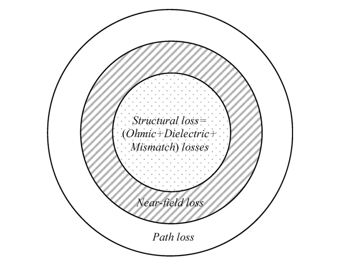

Losses
------

There are three major losses related to an antenna: the structural losses of the antenna itself, near-field losses and the planar wave path losses (:numref:`antenna-loss-regimes`). The structural loss of an antenna is seen as ohmic and dielectric losses depending on the environment surrounding the antenna, such as free space, lossy or any other medium and the loss is converted into heat over the antenna. Reactive near-field losses are transformed into thermal energy by heating the environment around the antenna. The near-field losses are highly dependent on the antenna type as it is related to the current distribution on the antenna. Finally, the path losses are related to the planar waves due to the remote area and are are independent of the antenna type :cite:`manteghi:2014study`. 

    : Antenna loss regimes.