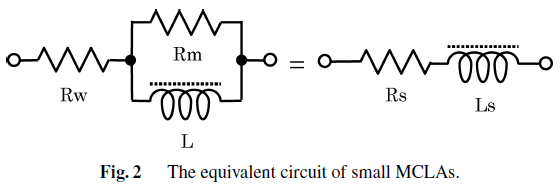

Quality Factor
--------------

        : Equivalent circuit of small magnetic core loop antenna.

Quality factor of the equivalent circuit can be approximated as follows where R_w≪R_m is assumed [Abe and Takada, 2007].

.. math::
	:label: Q

	Q = \frac{1}{\frac{R_w}{\omega L}+\frac{\omega L}{R_m}} \cong \frac{1}{\frac{R_w}{\omega L}+\Bigl( \frac{\tan \delta}{\mu_i} \mu_{app} \Bigr)}

where :math:`\tan \delta / \mu_i` is relative loss factor of the core (from datasheet), :math:`\mu_{app}=L/L_0` is ratio between the inductance of the coil attached to the core and the coil itself and :math:`R_w` is winding resistance.

Quality factor of a resonator, Q, indicates its bandwidth relative to the center frequency:

.. math::
	:label: Q2

	Q=\frac{f}{\Delta f}

Alternatively, it can be defined as a ratio of average stored energy and energy loss:

.. math::
	:label: Q3

	Q = \omega \frac{W_m+W_e}{P_{loss}}

where :math:`W_m` and :math:`W_e` are the average magnetic and electric energy stored in the circuit and :math:`P_{loss}` is the power loss. At resonance Wm and We are equal. 

Higher :math:`Q` indicates a lower rate of energy loss relative to the stored energy of the resonator; the oscillations die out more slowly [wiki: Q factor].

As the ferrite rod antenna is not a pure parallel resonator mainly due to the series resistance of the inductor, the quality factor is derived from the total quality factor of the individual quality factors of the inductor and the parallel capacitor:

.. math::
	:label: Q_i

	Q_i = \frac{\omega L}{R_i}

.. math::
	:label: Q_c

	Q_c = \frac{1}{\omega C R_c}

The resulting quality factor is

.. math::
	:label: Q4

	Q = \frac{\omega L}{\omega^2 LCR_c+R_i}

which at resonance becomes

.. math::
	:label: Q5

	Q = \frac{\omega L}{R_c+R_i}

Typically, capacitors have a much higher quality factor with a small resistance :math:`R_c` compared to the coil resistances. The quality factor of the system is determined by the quality factor of the coil [Koskimaa, 2016].

