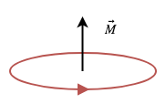
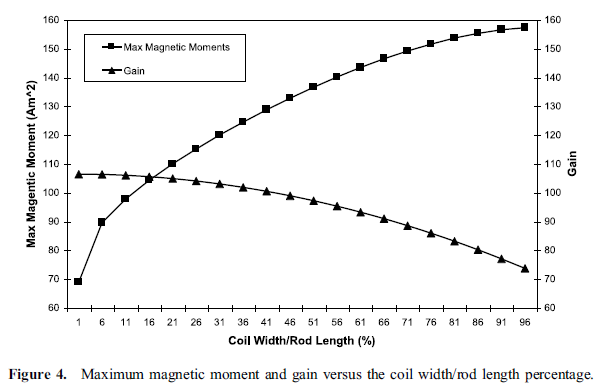
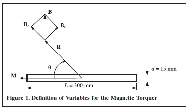

Magnetic Dipole Moment
======================

Magnetic dipole moment is a vector that point out of the plane of the loop and the magnitude of moment for a static field equals to the product of the flowing current in and cross-sectional area of the loop.

        : Magnetic dipole moment equivalent of a loop.

A comparison of magnetic and electric field components with those of the infinitesimal magnetic dipole indicates that they have similar forms. In fact, the electric and magnetic field components of an infinitesimal magnetic dipole of length l and constant “magnetic” spatial current :math:`I_m` are givenby

.. math::
	:label: electric_field_components_magnetic_dipole
	
	\begin{aligned} 
	E_r &= 0 \\
	E_\theta &= 0 \\
	E_\phi &= -j \frac{ k I_m l \sin \theta}{4 \pi r} \left[ 1 + \frac{1}{jkr} \right] e^{-jkr}
	\end{aligned} 
	
.. math::
	:label: magnetic_field_components_magnetic_dipole
	
	\begin{aligned} 
	H_r &= \frac{I_m l \cos \theta}{2 \pi \eta r^2} \left[ 1 + \frac{1}{jkr} \right] e^{-jkr} \\ 
	H_\theta &= j \frac{ k I_m l \sin \theta}{4 \pi \eta r} \left[ 1 + \frac{1}{jkr} - \frac{1}{(kr)^2} \right] e^{-jkr} \\ 
	H_\phi &= 0 
	\end{aligned} 
	
These can be obtained, using duality, from the fields of an infinitesimal electric dipole. When :eq:`electric_field_components_magnetic_dipole` and :eq:`magnetic_field_components_magnetic_dipole` are compared with magnetic and electric field components, they indicate that a magnetic dipole of magnetic moment :math:`I_m l` :is equivalent to a small electric loop of radius a and constant electric current :math:`I_0` provided that

.. math::
	:label: I_ml
	
	I_m l = j S \omega  \mu I_0
	
where :math:`S = \pi a^2` (area of the loop). Thus, for analysis purposes, the small electric loop can be replaced by a small linear magnetic dipole of constant current. The magnetic dipole is directed along the z-axis which is also perpendicular to the plane of the loop.

Loop analysis based on magnetic dipole moment is given in Electromagnetic Waves & Antennas - S. J.Orfanidis – 2008 book CH 15.
		
Time-Varying, Cored and N-Turn Loop Antenna
-------------------------------------------

Dunbar noted that in order to increase the effective area artificially through the use of a permeable core and a multi-turn coil. It is quite successful provided the flux density is kept well below the saturation level. Thus, the effective area becomes :math:`NS\mu_{cer}` and magnetic dipole moment becomes [Dunbar, 1972]. This magnetic moment can be also used in a conductive medium.

.. math::
	:label: M_cored
	
	M = j \omega \mu_0 \mu_{cer} ISN
	
In order to quantify the magnetic moment for our rod antenna, we will compare its magnetic field to the magnetic field produced by an air core planar loop of current (i.e., :math:`IS`, where :math:`S` represents the loop area). Essentially, we will enforce the equivalence theorem to determine the necessary moment for an air core planar loop of current that will produce the same external magnetic field as our rod antenna. The magnetic moment will be determined by using the broadside magnetic field component [Jordan et.al., 2009].

	: Maximum magnetic moment and gain versus the coil width/rod length percentage [Jordan et.al., 2009].

The electromagnetic field of the ferrite-loaded transmitting loop is given by Eq 5-1 to 5-3 with the moment :math:`m=\mu_rod F_v I_o NA`. The ferrite-loaded loop, however, is seldom used as a transmitting antenna because of the problems associated with the nonlinearity and the dissipation in the ferrite at high magnetic field strengths [Antenna Engineering Handbook 3Ed - R.C.Johnson H.Jasik – 1993, p5-9].

Static, Cored and N-Turn Loop Antenna
-------------------------------------

Devore and Bohley noted that magnetic dipole moment of a ferrite loaded loop has two component that magnetic dipole moment of ferrite core and winding [Devore Bohley, 1977]. 

.. math::
	:label: M_db
	
	M = M_F + M_w

.. math::
	:label: M_w_and_M_F
	
	\begin{aligned}
	M_w &= NIS \cong NIV/l \\
	M_F &= (\mu - 1) H_F V_F
	\end{aligned}

where

.. math::
	:label: M_w_and_M_F_var
	
	\begin{array}{c}
	H_F = \frac{H_0}{1+ D_F (\mu - 1)} \\
	H_0 \approx H_w = \frac{n}{l_w} (1-D_F) I \\ 
	V_F = l_F \pi {a_F}^2
	\end{array}

Moment of Torquer
-----------------

	: Torquer.

The definition of variables for the magnetic torquer is as shown in :numref:`torquer-image`, where :math:`M` represents the dipole moment of the torquer, :math:`\theta` is the angle with respect to the torquer axis, :math:`R` is the distance from the center of the coil, and :math:`l` is the effective coil length. Also, :math:`B` is the magnetic-flux density, :math:`B_r` and :math:`B_t` are the radial and tangential components of :math:`B`, respectively [Lee et. al., 2002].

If :math:`\theta = 90^\circ`,

.. math::
	:label: M_torquer_90
	
	M = \frac{4 \pi}{\mu_0} \biggl( R^2 + \frac{L^2}{4} \biggr)^{3/2} B_t

If :math:`\theta = 0^\circ`,

.. math::
	:label: M_torquer_0

	M = \frac{4 \pi}{\mu_0} \frac{1}{\frac{\frac{R}{L} - \frac{1}{2}}{(R^2 - RL + \frac{L^2}{4})^3/2} - \frac{\frac{R}{L} + \frac{1}{2}}{(R^2 + RL + \frac{L^2}{4})^3/2}} B_r

Mehrjardi and Mirshams noted that an equation of magnetic dipole moment [Mehrjardi and Mirshams, 2010]

.. math::
	:label: M_Mehrjardi
	
	M = \mu_{cer} NSI