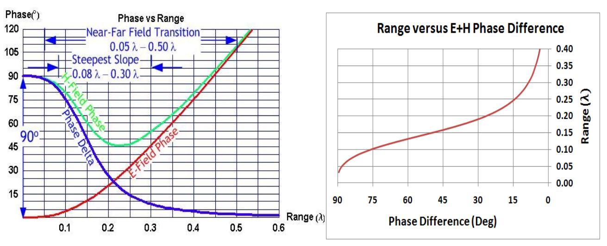

Near field Propagation
======================

Phase Behaviour
---------------

In the far field, the electric and the magnetic fields move with perfectly sychronized phase. In the near field, phases of the electric and the magnetic field diverge. These fields are 90 degree out of phase close to an electrically small antenna :cite:`schantz:2005near2`. 

Schantz explained as follows: *"A simple thought experiment involving electromagnetic energy flow establishes why the fields are in quadrature close to an electrically small antenna and in phase far away. The Poynting vector (:math:`S = E×H`) is the measure of the energy flux around the hypothetical small antenna. If the electric and magnetic fields are phase synchronous, then when one is positive, the other is positive and when one is negative the other is negative. In either case, the Poynting flux is always positive and there is always an outflow of energy. This is the radiation (or “real power”) case. If the electric and magnetic fields are in phase quadrature, then half the time the fields have the same sign and half the time the fields have opposite signs. Thus, half the time the Poynting vector is positive and represents outward energy flow and half the time the Poynting vector is negative and represents inward energy flow. This is the reactive (or “imaginary power”) case. Thus, fields in phase are associated with far field radiation and fields in quadrature are associated with near field quadrature."* :cite:`schantz:2005near2`

Schantz investigated phase behaviour of an electric dipole regards to dipole moment and carried out numerical analysis and experimental tests. Analytical formulations of the electric and magnetic field phases in the near field region were given below. Numerical analysis of phases was good agreement with theoritical formualas. In addition, experiment results of phase difference of electric and magnetic field in the near field region have also good agreement with theory :cite:`schantz:2005near2`.  

.. math::

    \Phi_H = -\frac{\omega r}{c} - cot^{-1}( \frac{\omega r}{c} ) - n\pi \\
    \Phi_E = -\frac{\omega r}{c} - cot^{-1}( \frac{\omega r}{c} - \frac{c}{\omega r} ) - n\pi 

There is a 90 degree phase difference between electric and magnetic components of the electromagnetic wave at close to a small antenna. These components converge to be in phase as far from the antenna. This near field behaviour of an antenna as shown in :numref:`near-field-phase-vs-range-richards2010`  The relation between distance and the phase difference is given by:

.. math::

    r = \frac{\lambda}{2\pi}\sqrt[3]{\cot{\Delta_\phi}}

.. tip::

    MathCAD calculation file can be downloaded from :download:`here <../_downloads/Range-vs-E-and-H-Phase-Difference.mcdx>`.

where :math:`r` is the distance from the antenna, :math:`\lambda` is the wavelength and :math:`\Delta_\phi` is the phase difference of electric and magnetic components :cite:`schantz:2007real,richards:2010electrically`. 

    : Phase relationships around an electrically small Hertzian dipole (left). Range versus electric-magnetic phase difference for a NFER signal (right).

Near Field Propagation based on Friis Law
-----------------------------------------

Within the near-field, propagation relation for electric-electric or magnetic-magnetic antennas (like antennas) is

.. math::

    \frac{P_{rx}}{P_{tx}} = \frac{G_{rx}G_{tx}}{4} \left( \frac{1}{(kr)^6} - \frac{1}{(kr)^4} + \frac{1}{(kr)^2} \right)

in which the ratio of received power :math:`P_{rx}` to transmitted power :math:`P_{tx}` follows from the transmit antenna gain :math:`G_{tx}`, the receive antenna gain :math:`G_{rx}`, the distance :math:`r` between antennas, and the wave number :math:`k=2\pi/\lambda` and wavelength :math:`\lambda` :cite:`richards:2010electrically`.

.. note::

    All these works provides a basis to :ref:`Real-time Locating Systems`.
