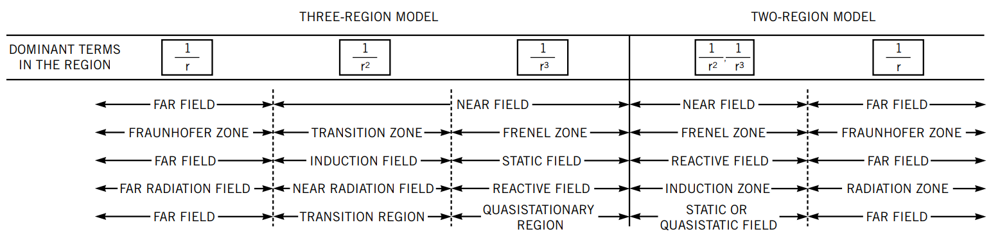
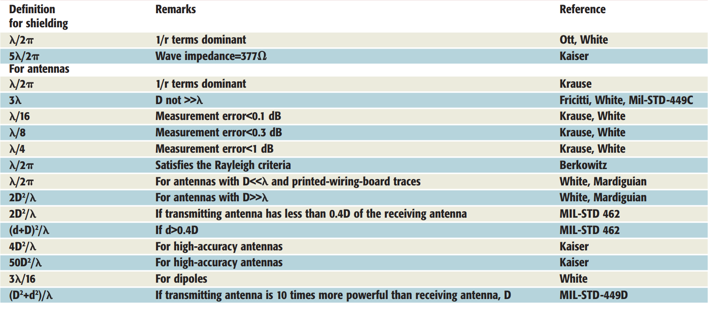

Near-Field and Far-Field
========================

Far-field and near-field describe fields around any electromagnetic source such as antennas. Therefore, two regions and a boundary between them exist around an antenna. Sometimes near-field is divided into two sub-regions. These two- and three-region models are shown :numref:`three-and-two-region-model`. Furthermore, various far field definitions can be found in the literature depending on the application area. :numref:`table-of-far-field-definitions` shows the definitions of near- and far-field boundary. A good discussion about near- and far-field definitions can be read in :cite:`capps:2001near`.

    : Two- and three-region models.

    : Definitions of near- and far-field boundary.