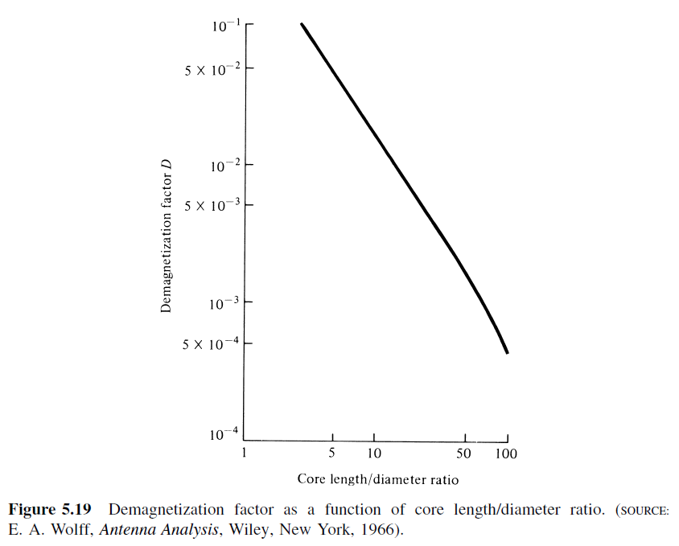
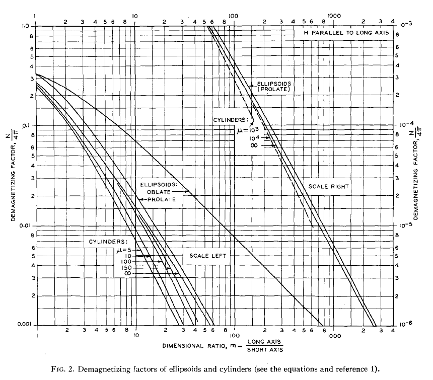
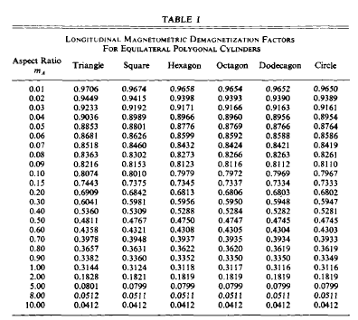
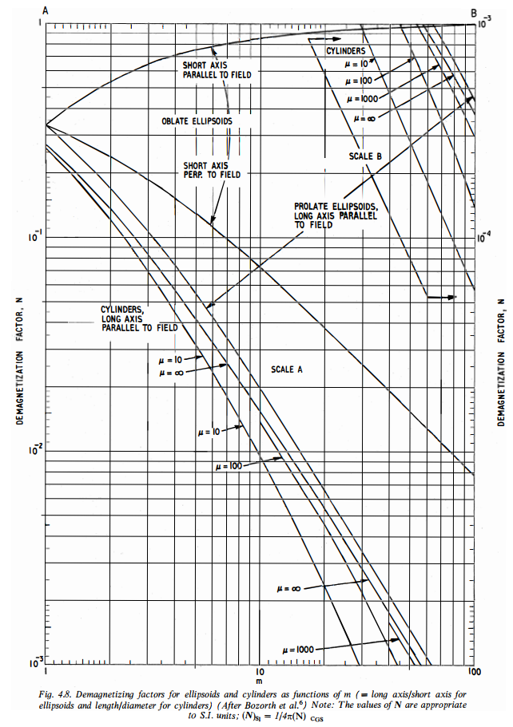
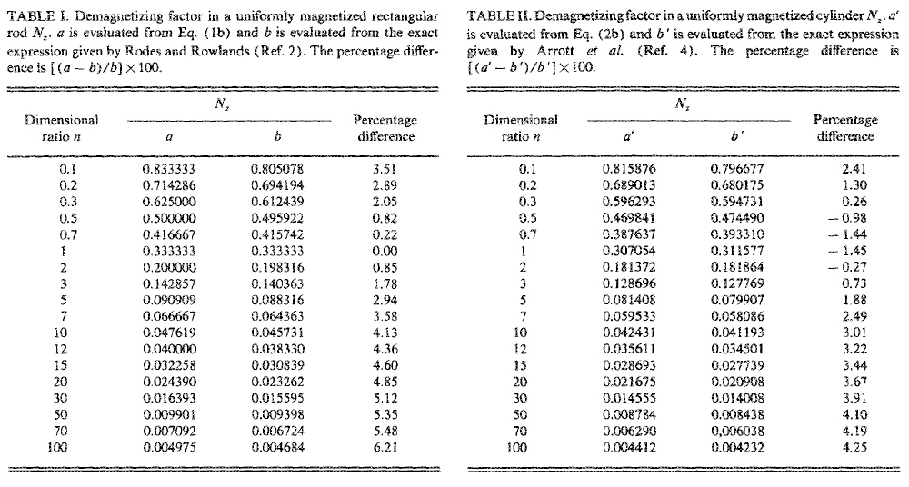
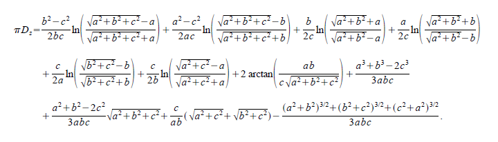
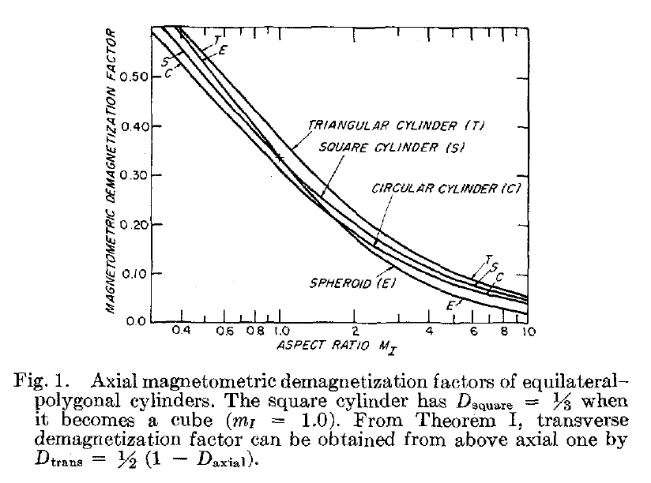

Demagnetization Factor
======================

Demagnetization factor has been found experimentally for different core geometries, as shown in :numref:`demagnetization-factor-balanis`. In general, demagnetization factor is a function of the geometry of the ferrite core :cite:`balanis:2005`.

        : Demagnetization factor as a function of core lenght/diameter ratio.

The demagnetizing factor can be calculated precisely only for ellipsoids of revolution, which have uniform magnetization. For a sphere, :math:`D_F = 1/3`, for a very thin plate, :math:`D_F = 1`; and for an infinitely long cylinder in a transverse field, :math:`D_F = 1/2`. For some specimens of simple shape, the demagnetizing factor is calculated by empirical formulas, but in most cases, it is determined experimentally [Dictionary, 2003].

The literature distinguishes between “magnetometric” and “fluxmetric” (or “ballistic”) demagnetizing factors :math:`D_m` and :math:`D_f`. If the sample is in a uniform applied field :math:`H_a` along its axis, the fluxmetric (or ballistic) demagnetizing factor :math:`D_f` is defined as the ratio of the average demagnetizing field to the average magnetization at the midplane perpendicular to the axis. The magnetometric demagnetizing factor :math:`D_m`, is defined as the ratio of the average demagnetizing field to the average magnetization of the entire sample [Chen at al., 1991].

Demagnetization Factor from Charts
----------------------------------

Bozorth and Chapin investigated :math:`D_F` of rods. A chart is constructed for converting the :math:`\mu_{ce}` to :math:`\mu` of cylinders of any given ratio of :math:`l_r/d_r`. The demagnetizing factors for oblate and prolate ellipsoids of revolution, and for rods having finite permeabilities, are plotted in :numref:`demagnetization-factor-bozorth` [Bozorth and Chapin, 1942].

Osborn investigated demagnetizing factors of the general ellipsoid. This article presents charts and tables which make possible easy determination of the demagnetizing factor for any principal axis of an ellipsoid of any shape. Formulas for the demagnetizing factors of the general ellipsoid are included together with supplementary formulas which cover many special cases [Osborn, 1945].

Rumsey and Weeks noted that the value of :math:`D_F` is known from the static solution; it depends on the shape of the ellipsoid and is independent of :math:`\mu` [Rumsey and Weeks, 1956].

        : Demagnetization factors of ellipsoids and cylinders.

Moskowitz et. al. investigated magnetometric demagnetization factors for regular polygonal cylinders. Longitudinal magnetometric demagnetization factors for several equilateral polygonal cylinders have been determined by inductance analogy from available tables of inductance. These values are listed in Table at :numref:`demagnetization-factor-moskowitz-table` as a function of the equivalent-area aspect ratio :math:`l_r/d_r` [Moskowitz et. al., 1966].

        : Demagnetization factors of polygonal cylinders.

Demagnetization Factor from Formulas
------------------------------------

:math:`D_F` is the demagnetizing factor of an ellipsoid with the dimensional ratio :math:`l_r/d_r` [Mager, 1968].

.. math::
	:label: D_F

	D_F=\frac{1}{\left(l_r/d_r\right)^2-1}\left[\frac{l_r/d_r}{\sqrt{\left(l_r/d_r\right)^2-1}\ln{\left(l_r/d_r+\sqrt{\left(l_r/d_r\right)^2-1}\right)}}-1\right]

        : Demagnetizing factors for ellipsoids and cylinders as functions of m (= long axis/short axis for ellipsoids and length/diameter for cylinders) [Snelling, 1969, p184].

A formula for can be constructed by fitting data given in the book [Snelling, 1969] as

.. math::

        D=\frac{0.28}{l_r/d_r}-0.0158-\frac{0.0915}{\mu_r}+\frac{0.00063l_r/d_r}{\log{\left(\mu_r\right)}}

where :math:`l_r/d_r` is the length to diameter ratio of the core, not the winding. The validity ranges are :math:`1<l_r/d_r<100` and :math:`1<\mu_r<1000` [Rhea, 1994].

Over a practical range of interest (:math:`2<lr/dr<20`) :math:`D` can be modeled as [Pettengill et.al., 1977, Burhans, 1979]

.. math::

        D=0.37\left(\frac{l_r}{d_r}\right)^{-1.44}

Demagnetizing factors of the rectangular rod

.. math::

        D=\frac{1}{2(l_r/d_r)+1}

and cylinder 

.. math::

        D=\frac{1}{2\left(\frac{2\left(l_r/d_r\right)}{\sqrt\pi}\right)+1}

magnetized uniformly along the long axis are found to be expressed by the simple and approximate expressions [Sato and Ishii, 1989].

        : demagnetizing-factor-sato-ishii-1989.

lt is found in Tables I and II that the results obtained by the simple and approximate expressions given by two equations above (ref!) well agree with the results obtained by the exact of the demagnetizing factors [Sato and Ishii, 1989].

Aharoni gave an analytic expression for the magnetometric demagnetizing factors of the general rectangular prism [Aharoni, 1998, Magpar, 2017].

        : ex14.

Demagnetization Factor from Formulas with Inductance
----------------------------------------------------

Moskowitz and Della Torre investigated a magnetometric demagnetization tensor for uniformly-magnetized samples of arbitrary geometry. The axial demagnetizing factor can be obtained from existing tables designed for calculating the inductance of solenoids. This is due to the analogous fields of the solenoid and the uniformly-magnetized cylinder. The analogy between the single-layer solenoid and the uniformly-magnetized cylinder

.. math::

        D_m=1-\left(\frac{L}{\mu_0n^2l_rA_r}\right)

where L is the inductance, A_r is the cross-section of the cylinder.

It is of interest to consider samples of uniform equilateral-polygonal cross-section. For such samples the aspect ratio l_r/d_r is the ratio of length to the diameter of the right circular cylinder of equal cross-sectional area. Thus, in general,

.. math::

        \frac{l_r}{d_r} = \frac{1}{2} \sqrt{ \frac{\pi}{A_r} }

where l is the length of the particle and d is the diameter of the circular cylinder of equal cross-sectional area A_r.

The demagnetization factor curves in Figure 4 are based on inductance values from [Grover, 1962, 1973], for coils of polygonal geometry. For any of the shapes given, there is less than 1% deviation between demagnetization factors of polygonal and circular cylinders for aspect ratios l_r/d_r above unity. For acicular particles (l_r/d_r~6.0) this deviation is less than 0.25% even for the most radical shape, the triangular cross-section [Moskowitz and Della Torre, 1966].

        : demagnetization-magnetometric-moskowitz-1966.

Values of D_F have been calculated for the right circular cylinder by direct integration and by the inductance analogy. Both results agree with tables published by Brown [Brown, 1962] and will not be repeated here. From Figure 4 note that the square cylinder has a demagnetization factor of 1/3 when it becomes a cube [Moskowitz and Della Torre, 1966].

Chen et. al. evaluated fluxmetric (ballistic) and magnetometric demagnetizing factors D_f and D_m, for cylinders as functions of susceptibility \chi and the ratio m_A of length to diameter. D_f and D_m were computed exactly using inductance formulas [Chen et. al., 1991]. 

Chen et al. evaluated, using exact general formulas, the fluxmetric D_f and magnetometric D_m demagnetizing factors of a rectangular prism of dimensions 2a\times2b\times2c with susceptibility \chi=0 and the demagnetizing factor, D, of an ellipsoid of semiaxes a,b, and c along the c axis [Chen et al., 2002].

Chen et. al. calculated numerically fluxmetric and magnetometric demagnetizing factors, D_f and D_m, for cylinders along the axial direction as functions of material susceptibility \chi and the ratio l_r/d_r of length to diameter. The results have an accuracy better than 0.1% [Chen et. al., 2006].

Note: Sintered magnet demagnetization curves and demagnetization force for magnets are given by Tokyoferrite Corporation [Tokyo Ferrite, 2017].