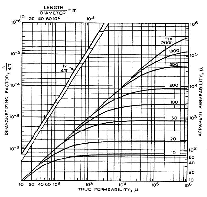
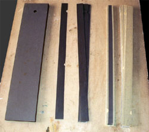

Magnetic Cores
==============

.. Definition

A magnetic core is a piece of magnetic material with a high magnetic permeability, high electrical resistivity, low coercive field strength, and low core loss used to confine and guide magnetic fields in electrical devices. It is made of ferromagnetic metal such as iron or soft magnetic alloys, or ferrimagnetic compounds such as ferrites. The high permeability, relative to the surrounding air, causes the magnetic field lines to be concentrated in the core material :cite:`wiki:magneticcore,astm:2013`.

.. Advantage & Disadvantage and usage

By using a magnetic core, the magnetic field strength inside the coil can be increased by a hundred times. However, magnetic cores have some side effects to consider. In alternating current applications such as transformers and inductors, they cause core losses due to hysteresis and eddy currents. Usually, soft magnetic materials with low coercivity and hysteresis such as silicon steel or ferrite are used :cite:`wiki:magneticcore`. 

#The great sensitivity of Induction coils is due to the high magnetic permeability of the material used to build the core. This material can be very expensive (try to search for mu-metal or permalloy on internet and you'll see!). But first of all we must consider the propriety of this coils in order to correctly dimension our project and get the best performances from our   expensive metal. 

        : Permeability of core [http://www.vlf.it/matteobruna/ULF_Induction-Coil.htm].

#When we construct coils like these we must consider that they haven't an ideal behavior. The graph on the left shows that the apparent magnetic permeability of a cylindrical core can be different from the magnetic permeability of the metal of which is made. In fact the apparent permeability depends on the geometric dimensions of the core, in particular on the lenght-to-diameter ratio. So before buying the metal for the core we must ensure that we can made the core with the right lenght-to-diameter ratio to get from it all the permeability that can give.

#The metal I choose for my coil's core is magnetic steel used for the construction of electrical transformers. It has a permeability around 1000, so I built the core with a lenght-to-diameter ratio around 50.

#A variable magnetic field in a conductor material makes currents to flow. These are called Foucault's currents and will surely flow also in our core absorbing part of the signal we want to receive. There is no possibility to eliminate this phenomenon, but it can be limited. The only way is to "cut" this currents by using materials with a high internal resistance (composite alloys) or to build the core with many little pieces of metal (bars or laminations) insulated from each other. The magnetic steel I used is sell in insulated foils, so, to build my core, I simply put many of these together trying to obtain a cylindrical shape to completely fill the free space inside the coil. The procedure is also well shown by Hans Michlmair in his article .

        : core-lamination-sheets [http://www.vlf.it/matteobruna/ULF_Induction-Coil.htm].

#To save money I got the magnetic steel from the discards of a transformers factory. Naturally it wasn't already in the right shape so I had to cut it in order to get foils narrow enough to fill the core's volume. At the end were composed four bars with a diameter of 4.5 cm and 70 cm long, that linked together forms a core of about 280 cm, so, with a lenght-to-diameter ratio of about 56 [http://www.vlf.it/matteobruna/ULF_Induction-Coil.htm].

#For the purpose of expressing material properties and design relations it is convenient to consider only sinusoidal wave forms. Ferrite cores are often used at quite low amplitudes. At these low amplitudes the non-linearity between :math:`B` and :math:`H` is small so that, to a first order, the waveform distortion may usually be neglected. Under these conditions, if the field strength is sinusoidal then the flux density and the e.m.f. (proportional to :math:`dB/dt`) may be taken as sinusoidal. Thus simple a.c. theory may be used to describe the influence of a magnetic material on an electric circuit [snelling]. 

#The inductance of a circuit may be defined as the flux linkage per unit current, i.e. for an alternating current of peak amplitude :math:`I`,

.. math::
	:label: L
	
	L = \frac{N\phi}{I}

#For a winding of :math:`N` turns on an ideal toroid of magnetic length :math:`l` and cross-sectional area :math:`A`
	
.. math::
	:label: L_extraction
	
	\begin{align}
	L &= \frac{NBA}{I} \\
	  &= \frac{NA}{I} \mu_0 \mu \frac{NI}{l} \\
	  &= \frac{\mu_0 \mu N^2 A}{l} \\
	  &= L_0 \mu
	\end{align}

.. math::
	:label: L_0
	
	L_0 = \frac{\mu_0 N^2 A}{l}

Nickel-Iron Soft Magnetic Materials
-----------------------------------

Nickel-Iron (Ni-Fe) alloys are a special class of magnetic materials based on the face-centered cubic crystal structure. Usually they contain 40% - 90% Ni, contains a few percent of other alloying elements such as Cu, Mo, Cr, Co, Mn, and the remainder is balanced with Fe. The Ni-Fe alloys or permalloys that contains nickels over 76-80% have been widely used in various applications since 1920. The magnetic properties of 80% Nickel alloy material were investigated under different conditions of *annealing temperature*, *cooling rates* and *holding time*. Magnetic properties of material such as induction, remanence, core loss, coercivity and peak permeability were evaluated at 300 Hz and 1 kHz by changing the magnetic field :cite:`gupta:2005`.

.. Standard

There is a standard about Nickel-Iron (Ni-Fe) soft magnetic materials that includes permeability and coercive field strength values for different shapes and four different alloy types :cite:`astm:2013`. 
