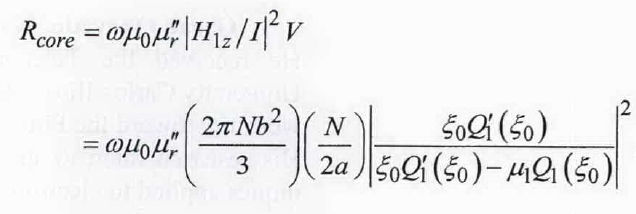
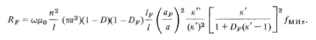
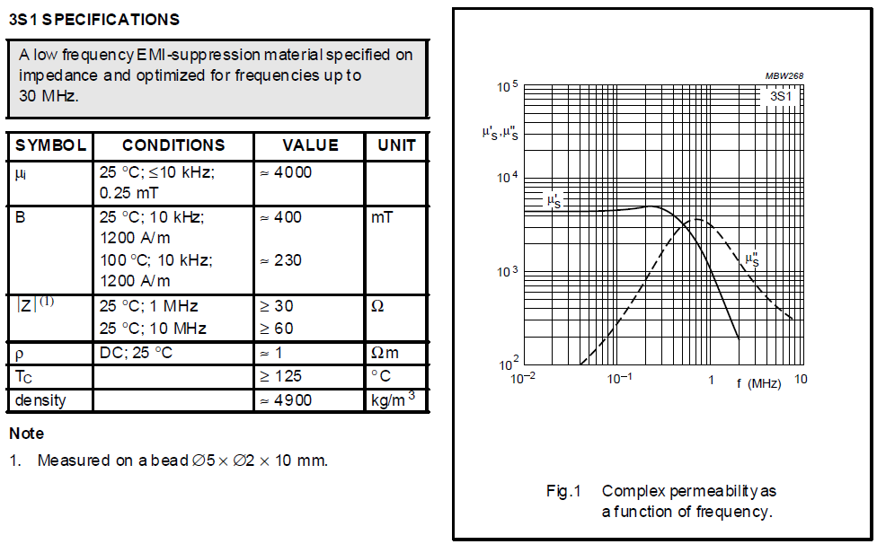
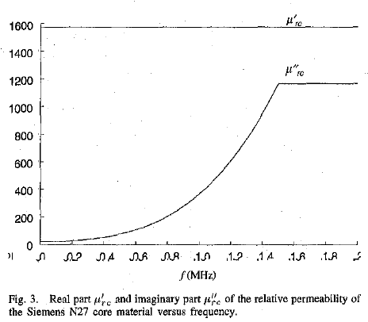

Core Loss
=========

Spheroidal Core
---------------

The core loss may be computed if the loss tangent of the core material is known or is available from published data. The loss tangent is defined in terms of a complex effective relative permeability, :math:`\mu_r=\mu_r^\prime-j\mu_r^{\prime\prime}`, as :math:`\tan{\delta=\mu_r^{\prime\prime}/}\mu_r^\prime` [Simpson and Zhu, 2007].

    : ex15.

Cylindrical Core
----------------

Devore and Bohley gave the core loss formulation which is dependent complex permeability of core below [Devore and Bohley, 1977].

    : ex16.

Another core loss formulation for ferrite loaded FM receiver antennas was given [Lindberg and Kaikkonen, 2007]

.. math::

    R_f=2\pi f\mu_0\mu_{cer}\frac{\mu\prime\prime}{\mu\prime}n^2\frac{A}{l}

Core Data
---------

Example catalog data of complex permeability as a function of frequency is shown below [Data Handbook of Soft Ferrites and Accessories, 2004]. 

    : core-data.

Another catalog data of Siemens EC52 ferrite core is given below [Kazimierczuk et. al., 1999].

    : core-data-siemens.

