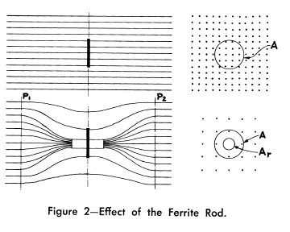
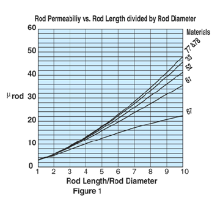

.. _introduction:

************
Introduction
************

Ferrite core electrically small loops are often used for receiving signals, such as in radios and pagers, where the signal to noise ratio is much important than efficiency. 

        : Effect of the ferrite rod [Laurent and Carvalho, 1962].

.. figure:: ../img/influence-of-a-ferrite-rod.png
        :align: center
        :scale: 100 %
        :name: influence-of-a-ferrite-rod

        : Influence of a ferrite rod [Alex Goldman-Modern Ferrite Technology-Springer (2010) p305].

Eshraghian et al. (1982), Ranasinghe (2007), and Cole et al. (2003) show that without the magnetic core the coupling volume of a long solenoid is just the physical volume, but when a magnetic core is inserted, the coupling volume increases by a factor equal to the effective permeability of the magnetic core [Serkan Aksoy, Mail, 10.08.2017].

The loops are rarely used as transmitting antennas above low levels of power due to their poor radiation efficiency (low radiation resistance). As transmitting antennas, they become less significant below 30 MHz. If the efficiency is not an issue and power levels are very low, they are used as a transmitter. Because they would soon become very hot when any reasonable levels of power are fed into them, they must be cooled (for example by water as in torpedo transmitter).

As an exception, a tuned transmitting loop, can be equipped with a remotely controlled capacitor to make a resonant circuit, is used to transmit waves. However, such loops have to be retuned whenever the frequency is changed (even in the same operating band) because they are extremely narrowband. Nonetheless, they are sometimes the only practicable option for transmission when space is restricted [Serkan Aksoy, Mail, 01.06.2017].

Dimensions
----------

For magnetic core antennas, the length of the magnetic core should be equal to the diameter of the equivalent air-core loop antenna in order to achieve an comparable performance over the air-core antennas. The two dimensions of the air-core antenna are large, whereas the magnetic core antenna is only one dimension large. Thus, the magnetic core antenna has the advantage of packaging. Electrostatic immunity is better and electrostatic protection can be applied more easily :cite:`stewart:1958on`.

# Cylindrical cores longer than a solenoid winding are used to increase L for a given physical size. Cylindrical cores shorter than the solenoid winding and moved along the winding axis are used for L tuning with the greatest L occurring with the core centered [Serkan Aksoy, Mail, 04.04.2017].

Measurement
-----------

Stewart investigated measurement of a ferrite core loop antenna. A general discussion was given about applications of small loops with air core and ferrite core. The data received by static measurement (below audio frequency) are largely valid and can be collected very quickly so that the tests of the magnetic core antennas with many parameters are obtained on a reasonable budget. Losses of the magnetic core increase above 20 MHz frequency and the magnetic core antennas are no longer as good as air-cored loops. RF measurements of the magnetic dipole antenna usually require that the antenna is electrically shielded; otherwise, it is impossible to seperate radiation into electric and magnetic components :cite:`stewart:1958on`.

Permeability (Influence of High-Frequency Magnetic Fields)
----------------------------------------------------------

The reaction of the magnetic induction B (and thus also of the magnetization) on an external alternating magnetic field H with a time dependence can be expressed as:

.. math::
	:label: BH

	\begin{array}{c}
	B=B_0 e^{i(\omega t - \delta)}\\
	H=H_0 e^{i\omega t}
	\end{array}

As a consequence the permeability  :math:`\mu` becomes complex:

.. math::
	:label: mu1

	\mu = \frac{B}{H} = \frac{B_0 e^{i(\omega t - \delta)}}{H_0 e^{i\omega t}} = \frac{B_0}{H_0}e^{-i\delta}

Using :math:`e^{-i\delta}=\cos⁡{\delta}-i \sin⁡{\delta}`  we get:

.. math::
	:label: mu2

	\mu = \frac{B_0}{H_0}\cos⁡{\delta} - i \frac{B_0}{H_0}\sin{\delta}

Characterizing the real and negative imaginary part of the permeability by:

.. math::
	:label: mu3

	\begin{array}{c}
	\mu'=\frac{B_0}{H_0}\cos⁡{\delta}\\
	\mu''=\frac{B_0}{H_0}\sin{\delta}
	\end{array}

we obtain [Fundamentals of magnetism - M.Getzlaff – 2008, p.139]:

.. math::
	:label: mu4

	\mu = \mu' -i\mu''

Due to the finite size of the ferrite rods, the effective permeability of the rod decreases near the ends of the solenoid. As a consequence of this, the inductance of the solenoid does not always grow as the square of the number of turns, as would be expected [Serkan Aksoy, Mail, 15.03.2017].

Figure 1 shows the rod permeability as a function of the length to diameter ratio for the six materials available in rods [Fair-Rite Rods Datasheet].

        : Rod permeability [fair-rite-datasheet].

Two Winding Solenoid
--------------------

.. figure:: ../img/two-winding-solenoid.png
        :align: center
        :scale: 100 %
        :name: two-winding-solenoid

        : Two winding solenoid.

Loopstick antenna from an AM radio having two windings, one for long wave and one for medium wave (AM broadcast) reception. Typically, 10 cm long, these loop antennas are usually hidden inside the radio receiver [Serkan Aksoy, Mail, 03.04.2017]. 

In the contra-wound configuration, introduced by the US Army Signal Corp many years ago and described in publications by Burhans and by Cornell, the coil wound on the ferrite rod is split into two equal parts wound withopposite sense. If the "outside" ends of these coils are grounded, a single-ended signal can be taken from the midpoint of the coil resulting in muchsimplified preamp design. Also, since the total coil inductance is halved (the half-coils would be in parallel), for a given required total inductance the number of turns can be increased providing increased sensitivity. (The total self-capacity of the windings is increased but ordinarily such would not be of principal concern.) [Serkan Aksoy, Mail, 29.07.2017] 

Notes
-----

Mark 48 torpedo

Unconfirmed reports indicate that the torpedo's sensors can monitor surrounding electrical and magnetic fields. This may refer to the electromagnetic coils on the warhead (at least from 1977 to 1981), used to sense the metallic mass of the ship's hull and detonate at the proper stand-off distance [Serkan Aksoy, Mail, 08.04.2017].

A magnetic fuze reacts to the variable magnetic field of a ship is necessary for the most successful position of detonation under the keel of the ship. Work on this aspect of the bomb was found to be far from complete. The susceptibility to disturbances and the reaction capacity of such fuzes had not been investigated thoroughly either. A magnetic proximity fuze, however, is necessary for greater release ranges and for curved underwater trajectories.

Good detonation positions can be achieved with straight underwater travel if the fuze is set to go off after a specific distance through the water. The angle of entry must naturally not be altered as the underwater travel depends on the angle of entry. The time delay set on the fuze can be determined most simply by assuming a constant time for underwater travel.

In designing the fuze system, the following points must be borne in mind. Further, the speed and range of release must be functioned very accurately for a pre-set time as the tolerance of plus or minus 0.1 second can only be achieved with a clockwork fuze. Finally, the tail section must be jettisoned by explosive bolts or by some other adequate method on impact with the water [Serkan Aksoy, Mail, 11.04.2017].

The (modern) German navy uses submarines whose hulls are made entirely out of some classified non-magnetic alloy. This protects them from setting off static magnetic fuses and submarine detection systems [Serkan Aksoy, Mail, 11.04.2017].

.. figure:: ../img/distribution-of-flux-density-along-ferrite-snelling-1969.png
        :align: center
        :scale: 100 %
        :name: distribution-of-flux-density-along-ferrite-snelling-1969

        : distribution-of-flux-density-along-ferrite-snelling-1969 p188.

Analytical calculations of magnetic cored loops could not be calculated except for the special case of an ellipsoidal core, and even then calculations were approximate :cite:`stewart:1958on`. 
