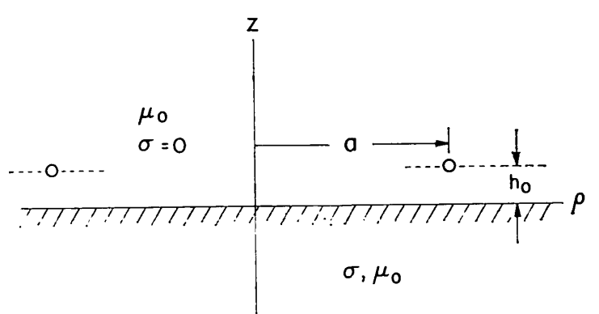

Impedance of a Small Loops
--------------------------

Over a Conducting Medium
^^^^^^^^^^^^^^^^^^^^^^^^^

In 1973 Wait and Spies investigated low-frequency input impedance of a circular loop over a conducting medium as shown in :numref:`loop-impedance-with-conducting-earth`. Impedance equation was given and calculated numerically. The impedance of the loop was analysed in terms of wire and loop radius, skin depth and loop height from ground. The limiting value of :math:`R` for the rate of loop radius to skin depth (:math:`a/\delta`) tending towards infinity was noted :cite:`wait:1973low`. 

    : Side view of circular loop over the conducting earth.

# The self resonance frequency (SRF) can be obtained by finding the frequency in which Im(Z) = 0 :cite:`cheng2017:analytical`.