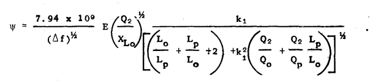
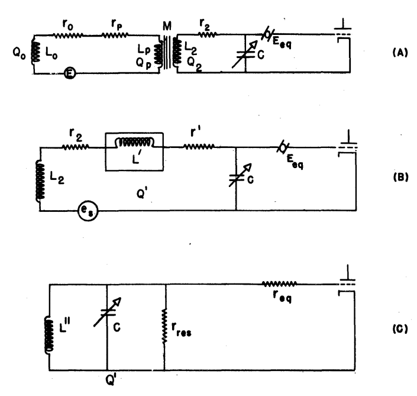
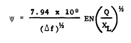
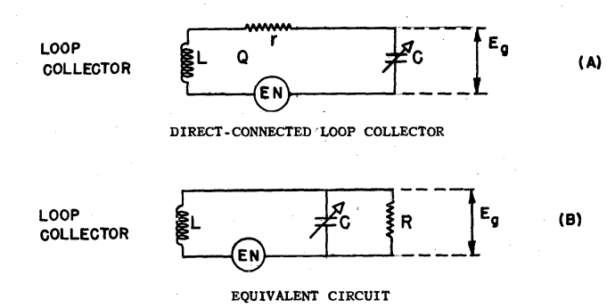

Signal to Noise Ratio (SNR)
===========================

The minimum signal that can produce a useful output from a radio receiver is determined by the output signal-to-noise ratio [CIA, 1957].

.. list-table:: Noise Sources [CIA, 1957]
    :widths: 1 1
    :header-rows: 1

    * - Externally Generated
      - Internally Generated
    * - Atmospheric (electrical storms)
      - Antenna ohmic resistance (thermal)
    * - Cosmic (extra-terrestrial radiation)
      - Coupling circuit resistance (thermal)
    * - Man-made static	
      - First amplifier or mixer (short noise)
    * - Precipitation static
      - 
    * - Radiation resistance (thermal)
      -

Rx
---

Laurent and Carvalho gave the signal to noise ratio of a receiving [Laurent and Carvalho, 1962].

.. math::

    \frac{S}{N}=\frac{EmA_r}{C}\left[\mu_{cer}+\left(\frac{d_c^2}{d_r^2}-1\right)\right]\sqrt{\frac{\omega_0Q_L}{4KT\Delta f d_c\mu_cF}}

- E 	magnitude of the electric field intensity vector
- m 	modulation index
- A_r 	area of the rod
- C 	total tuning capacitance
- \omega_0 	resonance frequency
- Q_L=\omega_0\frac{R_pR_L}{R_p+R_L}C	
- K=1.38\ {10}^{-23}	Boltzmann's constant [Joules/Kelvin]
- T	Temperature in degrees Kelvin
- \Delta f	3 db bandwidth of the device
- \mu_c=L_2/L_1	coefficient of change in inductance when the rod is inserted
- F	form factor (geometry of the coil)

Fratianni obtained the optimum signal to noise ratio equation for a transformer coupled loop system and direct coupled loop system[Fratianni, 1948]

Transformer coupled
-------------------

    : ex17.

    : snr-transformer-coupled.

Direct Connected
----------------

    : ex18.

    : snr-direct-connected.

- Lp: primary inductance
- Lo: loop inductance
- K1: coupling coefficient of transformer
- Q0: q value of loop
- Qp: q value of primary
- Q2: q value of secondary
- Delta f: the width in cps of the equivalent rectangle having the same area as the squared transmission characteristic of the input circuit
- XL0: reactance of loop
- E: loop induced voltage
