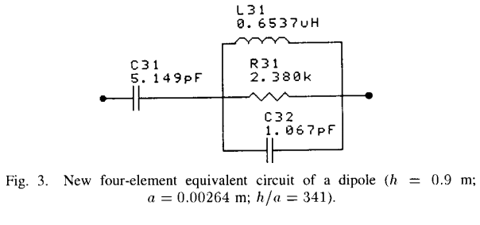

Electric Dipole Antennas
************************

.. _circuit-model-of-dipole-antenna:

Circuit Model of Dipole Antenna
===============================

Tang et al investigated a lumped equivalent circuit model as shown in :numref:`circuit-model-tang1993` to represent the impedance of a electrically small dipole antenna that electrical half-length up to 0.3 wavelength. The elements were related to the physical dimensions of the antenna and independent of the operation frequency. The equivalent circuit comprises the first resonance and all frequencies below the resonance. The proposed model was shown that the radiation resistance had less than 1% error and the reactance had less than 6% error :cite:`tang:1993equivalent`.

        : Four-element equivalent circuit of a dipole.

.. math::

        C_{31} &= \frac{12.0674 h}{\log(2h/a)-0.7245}\\[10pt]
        C_{32} &= 2h \left\lbrace \frac{0.89075}{[\log(2h/a)]^{0.8006} - 0.861} - 0.02541 \right\rbrace\\[10pt]
        L_{31} &= 0.2h \{ [1.4813 \log (2h/a)]^{1.012} - 0.6188\}\\[10pt]
        R_{31} &= 0.41288[\log(2h/a)]^2 + 7.40754(2h/a)^{-0.02389} - 7.27408

