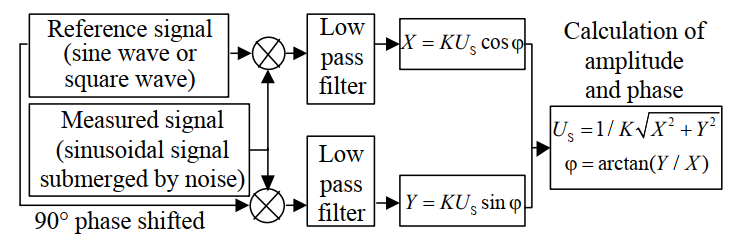

.. _lock-in-amplifiers:

******************
Lock-in Amplifiers
******************

#Lock-in amplifiers were invented in the 1930’s and commercialized in the mid 20th century as electrical instruments capable of extracting signal amplitudes and phases in extremely noisy environments :cite:`Zurich2016Principles`.

Why Use a Lock-In?
==================

#Let's consider an example. Suppose the signal is a 10 nV sine wave at 10 kHz. Clearly some amplification is required to bring the signal above the noise. A good low-noise amplifier will have about 5 nV/√Hz of input noise. If the amplifier bandwidth is 100 kHz and the gain is 1000, we can expect our output to be 10 µV of signal (10 nV × 1000) and 1.6 mV of broadband noise (5 nV/√Hz × √100 kHz × 1000). We won't have much luck measuring the output signal unless we single out the frequency of interest.

#If we follow the amplifier with a band pass filter with a Q=100 (a VERY good filter) centered at 10 kHz, any signal in a 100 Hz bandwidth will be detected (10 kHz/Q). The noise in the filter pass band will be 50 µV (5 nV/√Hz × √100 Hz × 1000), and the signal will still be 10 µV. The output noise is much greater than the signal, and an accurate measurement can not be made. Further gain will not help the signal-to-noise problem.

#Now try following the amplifier with a phase-sensitive detector (PSD). The PSD can detect the signal at 10 kHz with a bandwidth as narrow as 0.01 Hz! In this case, the noise in the detection bandwidth will be 0.5 µV (5 nV/√Hz × √.01 Hz × 1000), while the signal is still 10 µV. The signal-to-noise ratio is now 20, and an accurate measurement of the signal is
possible :cite:`srsan3`.

What Does a Lock-In Measure?
============================

#So what exactly does the lock-in measure? Fourier's theorem basically states that any input signal can be represented as the sum of many sine waves of differing amplitudes, frequencies and phases. This is generally considered as representing the signal in the "frequency domain". Normal oscilloscopes display the signal in the "time domain". Except in the case of clean  sine waves, the time domain representation does not convey very much information about the various frequencies which make up the signal.

#A lock-in multiplies the signal by a pure sine wave at the reference frequency. All components of the input signal are multiplied by the reference simultaneously. Mathematically speaking, sine waves of differing frequencies are orthogonal, i.e. the average of the product of two sine waves is zero unless the frequencies are EXACTLY the same. The product of this multiplication yields a DC output signal proportional to the component of the signal whose frequency is exactly locked to the reference frequency. The low pass filter (which follows the multiplier) provides the averaging which removes the products of the reference with components at all other frequencies.

#A lock-in amplifier, because it multiplies the signal with a pure sine wave, measures the single Fourier (sine) component of the signal at the reference frequency. Let's take a look at an example. Suppose the input signal is a simple square wave at frequency f. The square wave is actually composed of many sine waves at multiples of f with carefully related amplitudes and phases. A 2 Vpp square wave can be expressed as:

.. math::

    S(t) = 1.273 sin(\omega t) + 0.4244 sin(3\omega t) + 0.2546 sin(5\omega t) + ...

where ω = 2πf. The lock-in, locked to f, will single out the first component. The measured signal will be 1.273sin(ωt), not the 2 Vpp that you'd measure on a scope. 

#In the general case, the input consists of signal plus noise. Noise is represented as varying signals at all frequencies. The ideal lock-in only responds to noise at the reference frequency. Noise at other frequencies is removed by the low pass filter following the multiplier. This "bandwidth narrowing" is the primary advantage that a lock-in amplifier provides. Only inputs with frequencies at the reference frequency result in an output :cite:`srsan3`.

RMS or Peak?
------------

#Lock-in amplifiers, as a general rule, display the input signal in volts rms. When a lock-in displays a magnitude of 1 V (rms), the component of the input signal (at the reference frequency) is a sine wave with an amplitude of 1 Vrms, or 2.8 Vpp. Thus, in the previous example with a 2 Vpp square wave input, the lock-in would detect the first sine component, 1.273sin(ωt). The measured and displayed magnitude would be 0.90 Vrms (or 1.273/√2) :cite:`srsan3`. 

Degrees or Radians?
-------------------

#In this discussion, frequencies have been referred to as f (Hz) and ω (2πf radians/s). This is because people measure frequencies in cycles per second, and math works best in radians. For purposes of measurement, frequencies as measured in a lock-in amplifier are in Hz. The equations used to explain the actual calculations are sometimes written using ω to simplify the expressions.

#Phase is always reported in degrees. Once again, this is more by custom than by choice. Equations written as sin(ωt + θ) are written as if θ is in radians, mostly for simplicity. Lock-in amplifiers always manipulate and measure phase in degrees :cite:`srsan3`.

Lock-in amplifier working principle
===================================

#Lock-in amplifiers use the knowledge about a signal’s time dependence to extract it from a noisy background. A lock-in amplifier performs a multiplication of its input with a reference signal, also sometimes called down-mixing or heterodyne/homodyne detection, and then applies an adjustable low-pass filter to the result. This method is termed demodulation or phasesensitive detection and isolates the signal at the frequency of interest from all other frequency components. The reference signal is either generated by the lock-in amplifier itself or provided to the lock-in amplifier and the experiment by an external source :cite:`Zurich2016Principles`.

#The reference signal is usually a sine wave but could have other forms, too. Demodulation with a pure sine wave enables selective measurement at the fundamentalfrequency or any of its harmonics. Some instruments use a square wave which also captures all odd harmonics of the signal and, therefore, potentially introducing systematic measurement errors :cite:`Zurich2016Principles`.

    : Lock-in amplifiers are capable of measuring the amplitude and the phase of a signal relative to a defined reference signal, even if the signal is entirely buried in noise :cite:`Zurich2016Principles`.

Dual Phase Lock-in Amplifier Working principle
==============================================

#The principal advantage of the dual-phase unit is that if the signal channel phase (but not its amplitude) changes then the magnitude display will remain constant, even though the X and Y outputs change. Hence, if the lock-in amplifier is set to display vector magnitude R, changes in the signal phase will not affect the reading, and the instrument does not require the adjustment of the reference phase-shifter circuit. This capability is the main reason for the dual-phase instrument’s widespread use :cite:`Burdett2005`.

#Dual-phase lock-in amplifier avoid the error caused by the phase shift circuit used in single phase lock-in amplifier, which can greatly improve the detection accuracy.

#The principle of dual phase lock-in amplifier is shown in :numref:`schematic-dual-phase-lock-in-amplifier` The dual-phase lock-in amplifier has two phase orthogonal reference signals whose phase is 0 degrees and 90 degrees. The reference signal is always sine wave of the same frequency as the measured signal. Then the amplitude and phase of measured signal can be get accurately by doing multiplication related operation between the measured signal and two phase-orthogonal reference signals.

    : Schematic diagram of dual-phase lock-in amplifier.

#Define the measured signal :math:`u_S` and reference signals :math:`u_{R-1}` and :math:`u_{R-2}` as follows:

.. math::

    u_S = U_S sin(\omega t + \varphi) + n(t)

where :math:`n(t)` represents noise.

.. math::

    u_{R-1} = U_R sin(\omega t) \\
    u_{R-2} = U_R sin(\omega t + \pi/2)

#Do multiplication related operation between the measured signal and two phase-orthogonal reference signals. Then the outputs of the two low pass filters are as follows:

.. math::

    X = \frac{1}{2} U_R U_S cos(\varphi) \\
    Y = \frac{1}{2} U_R U_S sin(\varphi) \\

#Therefore, the amplitude and phase of the measured signal can be derived from the following formula.

.. math::

    U_S = \frac{2}{U_R} \sqrt{(X^2 + Y^2)}\\
    tan(\varphi) = \frac{X}{Y}

#From the above analysis, the measured sinusoidal signal of same frequency as the reference signal has transformed into two constants related to the amplitude and phase of the measured signal after multiplication related operation. The noise with different frequency with the reference signal is filtered by a low pass filter after multiplication related operation. Finally, the amplitude and phase of the measured signal can be obtained according to the two constants :cite:`qi2016design`.

Literature Review
=================

Qi et al investigated the design of a dual-phase lock-in amplifier with a DSP and a Labview interface. Preamplifier, filter and bias circuits were also designed. DSP and Labview algorithms were given. The relative error of amplitude was less than 2%, and the absolute error of phase is less than 3° when the additional noise is 100% of the weak sinusoidal signal :cite:`qi2016design`.

Zurich Instruments presented a white paper about lock-in amplifiers. Working principles were explained in detail. Dual-phase demodulation, signal mixing, and filtering steps were also explained in both time and frequency domains. SNR was mentioned and State of the art lock-in amplifiers was presented regards to products of Zurich Instruments :cite:`Zurich2016Principles`.

Stanford Research Systems presented an application note about lock-in amplifiers. Lock-in amplifiers were explained regards to phase sensitive detection (PSD) with examples. Working principles and terms about a lock-in amplifiers were also explained. Dynamic reserve were investigated. Last, noise sources that effect the lock-in signal were given in detail :cite:`srsan3`.

